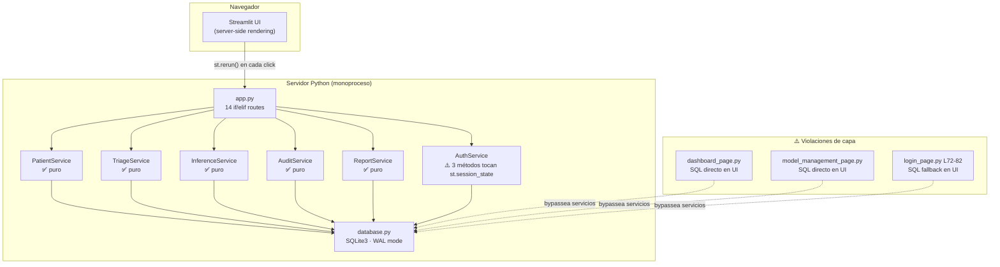
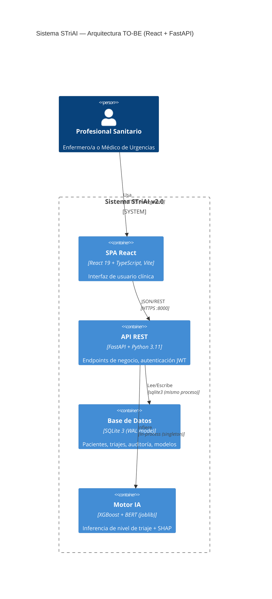
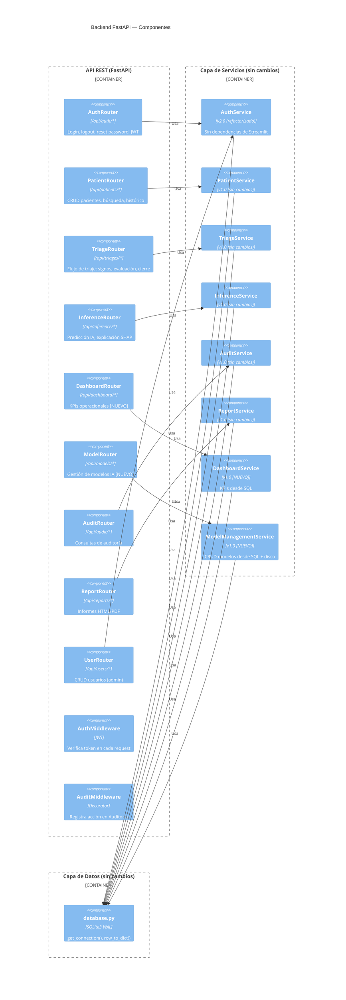
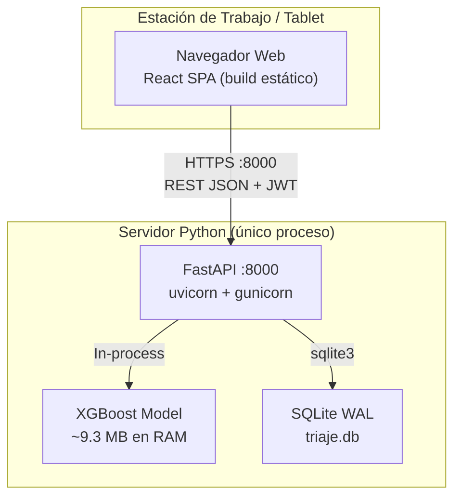
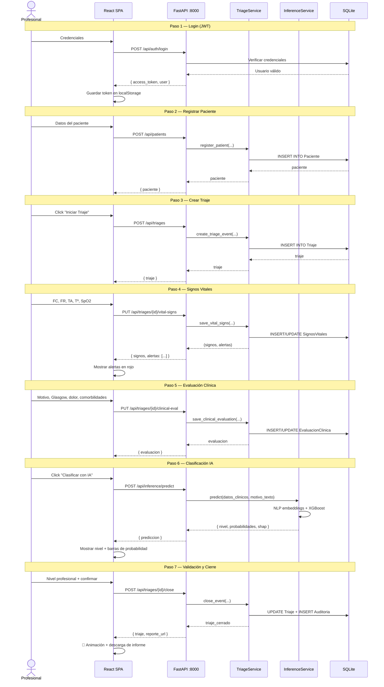

# Arquitectura TO-BE: Migración Frontend Streamlit → React

**Versión:** 1.0 · **Fecha:** 2026-07-21 · **Proyecto:** TFM UNIR — STriAI
**Tipología:** Caso C — Evolución AS-IS → TO-BE (migración parcial de capa de presentación)

---

## Tabla de Contenidos

1. [Resumen Ejecutivo](#1-resumen-ejecutivo)
2. [AS-IS: Diagnóstico de la Arquitectura Actual](#2-as-is-diagnóstico-de-la-arquitectura-actual)
3. [Análisis de Causa Raíz del Rendimiento](#3-análisis-de-causa-raíz-del-rendimiento)
4. [TO-BE: Arquitectura Propuesta](#4-to-be-arquitectura-propuesta)
5. [Gap Analysis: Qué Cambia y Qué No](#5-gap-analysis-qué-cambia-y-qué-no)
6. [Diseño de la API REST](#6-diseño-de-la-api-rest)
7. [Diseño del Frontend React](#7-diseño-del-frontend-react)
8. [ADR-002: Framework UI — React vs Streamlit](#8-adr-002-framework-ui--react-vs-streamlit)
9. [ADR-007: Estrategia de API — REST vs GraphQL](#9-adr-007-estrategia-de-api--rest-vs-graphql)
10. [ADR-008: Estado del lado del servidor — JWT vs Sesiones](#10-adr-008-estado-del-lado-del-servidor--jwt-vs-sesiones)
11. [Estimación de Esfuerzo](#11-estimación-de-esfuerzo)
12. [Roadmap de Migración](#12-roadmap-de-migración)
13. [Riesgos y Mitigaciones](#13-riesgos-y-mitigaciones)
14. [Supuestos](#14-supuestos)
15. [Referencias](#15-referencias)

---

## 1. Resumen Ejecutivo

### 1.1 Problema

El usuario reporta que **los tiempos de carga de página en Streamlit son excesivamente lentos**, afectando la usabilidad clínica. La meta de usabilidad RNF-004 exige que un triaje completo se complete en < 5 minutos y que los tiempos de carga sean mínimos. La arquitectura actual de Streamlit — que re-ejecuta todo el script Python en cada interacción del usuario — está en el límite de lo aceptable incluso en modo demo, y sería inviable en un entorno clínico real con múltiples usuarios concurrentes.

### 1.2 Propuesta

Migrar **únicamente la capa de presentación** de Streamlit a React, manteniendo intacta la capa de servicios Python (PatientService, TriageService, InferenceService, AuditService, ReportService) y la base de datos SQLite. Se introduce una **API REST con FastAPI** como capa intermedia entre React y los servicios existentes.

### 1.3 Viabilidad

| Factor | Evaluación |
|---|---|
| **Acoplamiento UI-lógica** | ✅ Muy bajo — solo 3 métodos de AuthService (de ~50 funciones de servicio) tienen dependencias de `st.session_state` |
| **Calidad del backend** | ✅ Los servicios están bien separados: lógica de negocio pura, sin dependencias de Streamlit |
| **Capa de datos** | ✅ `database.py` es SQLite3 puro, sin acoplamiento a framework |
| **Pipeline ML** | ✅ Completamente independiente en `src/`, ya tiene su propio `run_pipeline.py` |
| **Deuda a resolver** | ⚠️ dashboard_page y model_management_page tienen SQL directo en UI — deben crearse servicios antes de exponer API |
| **Complejidad** | Medio — 14 pantallas React + ~40 endpoints REST + refactorización de AuthService |

### 1.4 NO se migra

- ❌ **No se cambia la base de datos** (SQLite se mantiene; migrar a PostgreSQL es un proyecto separado)
- ❌ **No se cambia el pipeline de ML** (sigue en `src/`, ejecución offline)
- ❌ **No se migra a microservicios** (se mantiene el monolito modular con API REST)
- ❌ **No se toca la lógica de negocio** de PatientService, TriageService, InferenceService, AuditService, ReportService

---

## 2. AS-IS: Diagnóstico de la Arquitectura Actual

### 2.1 Estructura actual (Monolito Streamlit)



### 2.2 Análisis de acoplamiento Streamlit ← → Servicios

Se inspeccionaron las ~6,000 líneas de código en `sistema-triaje-ia/app/`. Resultados:

| Capa | Archivo | Líneas | Dependencias de Streamlit |
|---|---|---|---|
| **UI** | `login_page.py` | 160 | `st.*` (esperado) + **SQL fallback L72** |
| **UI** | `patient_page.py` | 650 | `st.*` (esperado) |
| **UI** | `vital_signs_page.py` | 350 | `st.*` (esperado) |
| **UI** | `clinical_eval_page.py` | 400 | `st.*` (esperado) |
| **UI** | `ia_classification_page.py` | 450 | `st.*` (esperado) |
| **UI** | `triage_validation_page.py` | 350 | `st.*` (esperado) |
| **UI** | `dashboard_page.py` | 250 | `st.*` + **SQL directo** ❌ |
| **UI** | `model_management_page.py` | 300 | `st.*` + **SQL directo** ❌ |
| **UI** | `audit_page.py` | 200 | `st.*` (esperado) |
| **UI** | `user_management_page.py` | 200 | `st.*` (esperado) |
| **UI** | `control_cambios_page.py` | 90 | `st.*` (esperado) |
| **UI** | `historico_paciente_page.py` | 120 | `st.*` (esperado) |
| **UI** | `model_comparison_page.py` | 200 | `st.*` (esperado) |
| **UI** | `placeholders.py` | 15 | **Obsoleto** — eliminar |
| **Servicio** | `patient_service.py` | 540 | ✅ **CERO** |
| **Servicio** | `triage_service.py` | 780 | ✅ **CERO** |
| **Servicio** | `inference_service.py` | 600 | ✅ **CERO** |
| **Servicio** | `audit_service.py` | 250 | ✅ **CERO** |
| **Servicio** | `report_service.py` | 250 | ✅ **CERO** |
| **Servicio** | `auth_service.py` | 390 | ⚠️ **3 métodos** (logout, check_session_timeout, get_timeout_minutes) |
| **Servicio** | `audit_decorator.py` | 25 | ✅ CERO (pero nunca conectado a AuditService) |
| **Datos** | `database.py` | 350 | ✅ **CERO** |
| **Config** | `settings.py` | 32 | ✅ **CERO** |

**Conclusión:** De ~50 funciones de servicio expuestas, solo 3 (6%) tienen dependencias de Streamlit. La separación es excelente para una app que se construyó originalmente como monolito Streamlit.

### 2.3 Deuda técnica que bloquea la migración

| ID | Hallazgo | Ubicación | Impacto en migración |
|---|---|---|---|
| DT-001 | Dashboard consulta SQL directo en UI | `dashboard_page.py` | **Bloqueante** — requiere crear `DashboardService` |
| DT-002 | Gestión de modelos consulta SQL directo en UI | `model_management_page.py` | **Bloqueante** — requiere crear `ModelManagementService` |
| DT-003 | Login tiene fallback SQL hardcodeado en UI | `login_page.py` L72-82 | **Bloqueante** — debe moverse a `AuthService` |
| DT-004 | `AuthService.logout()` manipula `st.session_state` | `auth_service.py` L128-130 | **Bloqueante** — requiere refactorizar a método puro |
| DT-005 | `AuthService.check_session_timeout()` accede a `st.session_state` | `auth_service.py` L373-381 | Medio — lógica de timeout migra a JWT |
| DT-006 | Widget de búsqueda de paciente duplicado 4 veces | 4 archivos UI | Bajo — se resuelve naturalmente en React (componente reutilizable) |
| DT-007 | `TriageService._auditar()` no usa `AuditService.register()` | `triage_service.py` | Bajo — inconsistencia de capas, no bloqueante |
| DT-008 | `audit_decorator.py` es un stub nunca conectado | `audit_decorator.py` | Bajo — deuda preexistente |
| DT-009 | `InferenceService` usa singleton de módulo fuera de `st.session_state` | `inference_service.py` | Bajo — se reemplaza por inicialización en startup de FastAPI |

---

## 3. Análisis de Causa Raíz del Rendimiento

### 3.1 ¿Por qué Streamlit es lento en esta aplicación?

```
┌─────────────────────────────────────────────────────────┐
│              CICLO DE VIDA DE UNA INTERACCIÓN           │
│                                                         │
│  1. Usuario hace click en un botón                      │
│  2. Streamlit envía TODO el estado al servidor (JSON)   │
│  3. El servidor re-ejecuta app.py COMPLETO              │
│     ├── import de 14 módulos UI (sys.modules cleanup)   │
│     ├── import de 7 módulos de servicio                 │
│     ├── import de database.py                           │
│     ├── import de sklearn, xgboost, shap...             │
│     └── render de 14 if/elif branches                   │
│  4. El servidor devuelve HTML+JS al navegador           │
│  5. El navegador reemplaza el DOM completo              │
│                                                         │
│  Tiempo típico: 2-8 segundos por interacción            │
│  (incluso para operaciones triviales como click en tab) │
└─────────────────────────────────────────────────────────┘
```

**Causas específicas identificadas:**

| Causa | Impacto | Evidencia |
|---|---|---|
| **Re-ejecución completa del script** | 🔴 Crítico | Streamlit re-ejecuta `app.py` en cada interacción |
| **Limpieza agresiva de `sys.modules`** | 🔴 Crítico | `app.py` L28-38 — borra y recarga módulos en cada ciclo |
| **Carga del modelo ML en memoria** | 🟡 Medio | ~9.3 MB de modelo XGBoost cargado en `InferenceService` |
| **Import de librerías pesadas** | 🟡 Medio | scikit-learn, xgboost, shap, sentence-transformers se importan en cada ciclo |
| **Server-side rendering** | 🟡 Medio | Todo el HTML se genera en el servidor; no hay Virtual DOM |
| **No hay client-side state** | 🟡 Medio | Cada interacción requiere round-trip completo al servidor |
| **Sin conexión pooling SQLite** | 🟢 Bajo | Cada query abre/cierra conexión; costo marginal vs re-ejecución |

### 3.2 ¿Cómo lo resolvería React?

```
┌─────────────────────────────────────────────────────────┐
│         CICLO DE VIDA DE UNA INTERACCIÓN (REACT)        │
│                                                         │
│  1. Usuario hace click en un botón                      │
│  2. React actualiza estado local (useState)             │
│     └── Tiempo: < 16ms (1 frame)                       │
│  3. React re-renderiza SOLO el componente afectado      │
│     └── Virtual DOM diff → mínimo DOM update            │
│  4. Si necesita datos del servidor:                     │
│     ├── fetch() a endpoint REST (solo los datos)        │
│     └── React Query maneja caching/loading/error        │
│                                                         │
│  Tiempo típico: < 100ms para UI, < 500ms con API call   │
│  (10x-40x más rápido que Streamlit)                     │
└─────────────────────────────────────────────────────────┘
```

**Ganancias específicas:**

| Aspecto | Streamlit | React | Mejora |
|---|---|---|---|
| Click en tab / navegación | 2-4s (re-ejecución completa) | < 50ms (React Router) | **40-80x** |
| Envío de formulario | 3-6s | < 500ms (solo POST) | **6-12x** |
| Carga inicial de página | 5-10s (import de sklearn) | 1-2s (bundle JS estático) | **3-5x** |
| Búsqueda/filtrado | 2-4s | < 200ms (debounced fetch) | **10-20x** |
| Dashboard (múltiples queries) | 4-8s (5 queries secuenciales) | < 1s (fetch paralelo) | **4-8x** |
| Inferencia IA | 3-5s (modelo en memoria) | 3-5s (misma latencia de API) | Sin cambio |

> **Nota importante:** La latencia de inferencia del modelo (~3-5s) es inherente al pipeline ML (NLP embeddings + XGBoost) y NO mejorará con React. Lo que sí mejora drásticamente es todo lo demás: navegación, formularios, búsquedas, dashboard.

---

## 4. TO-BE: Arquitectura Propuesta

### 4.1 Vista de Contenedores (C4 N2)



### 4.2 Vista de Componentes (C4 N3) — Backend FastAPI



### 4.3 Vista de Despliegue (C4 Deployment)



> **Modo demo actual (RT-007):** Un solo servidor, sin Docker. Para producción multi-usuario real, se requeriría PostgreSQL + cola de inferencia asíncrona, pero eso está fuera del alcance de esta propuesta.

### 4.4 Diagrama de Secuencia — Flujo Principal de Triaje (TO-BE)



---

## 5. Gap Analysis: Qué Cambia y Qué No

### 5.1 Componentes que NO cambian (reutilización total)

| Componente | Líneas | Estado | Acción requerida |
|---|---|---|---|
| `PatientService` | 540 | ✅ Listo para API | **Cero cambios** |
| `TriageService` | 780 | ✅ Listo para API | **Cero cambios** |
| `InferenceService` | 600 | ✅ Listo para API | Ajustar inicialización (startup de FastAPI en vez de singleton de módulo) |
| `AuditService` | 250 | ✅ Listo para API | **Cero cambios** |
| `ReportService` | 250 | ✅ Listo para API | **Cero cambios** |
| `database.py` | 350 | ✅ Listo para API | **Cero cambios** |
| `settings.py` | 32 | ✅ Listo para API | Añadir variables de entorno para CORS, JWT secret |
| Catálogos (constantes) | ~200 | ✅ Listo para API | **Cero cambios** |
| `src/` (pipeline ML) | ~2,000 | ✅ Independiente | **Cero cambios** |
| `models/` (modelos serializados) | — | ✅ Independiente | **Cero cambios** |

### 5.2 Componentes que CAMBIAN

| Componente | Cambio | Esfuerzo | Prioridad |
|---|---|---|---|
| **`AuthService`** | Extraer `st.session_state` → parámetros de método puro. `logout()` devuelve void; `check_session_timeout(login_time, timeout_config)` recibe parámetros; `get_timeout_minutes(config)` recibe config | 🟢 Bajo (3 métodos) | P0 |
| **`login_page.py` L72-82** | Mover SQL fallback a `AuthService.authenticate()` o eliminar el fallback | 🟢 Bajo (10 líneas) | P0 |
| **`dashboard_page.py`** | Extraer 5 queries SQL a nuevo `DashboardService` con métodos: `get_kpis()`, `get_triages_7d()` | 🟡 Medio | P0 |
| **`model_management_page.py`** | Extraer queries SQL a nuevo `ModelManagementService` con métodos: `list_models()`, `register_model()`, `activate_model()`, `scan_disk_models()` | 🟡 Medio | P0 |
| **`app.py`** | Reemplazado por `main.py` (FastAPI app) + routers | 🟡 Medio | P0 |
| **14 archivos UI** | Reescritos en React (ver sección 7) | 🔴 Alto | P0 |

### 5.3 Componentes NUEVOS

| Componente | Descripción | Esfuerzo |
|---|---|---|
| **`main.py`** | FastAPI app factory, CORS, lifespan (inicializar BD + modelo) | 🟢 Bajo |
| **`routers/auth.py`** | POST login, POST logout, GET permissions, POST reset-token | 🟢 Bajo |
| **`routers/patients.py`** | CRUD pacientes + búsqueda + histórico | 🟢 Bajo |
| **`routers/triages.py`** | CRUD triajes + signos + evaluación + cierre | 🟡 Medio |
| **`routers/inference.py`** | POST predict, POST explain, GET status | 🟢 Bajo |
| **`routers/dashboard.py`** | GET kpis [NUEVO] | 🟢 Bajo |
| **`routers/models.py`** | CRUD modelos [NUEVO] | 🟢 Bajo |
| **`routers/audit.py`** | GET query, GET export | 🟢 Bajo |
| **`routers/reports.py`** | GET triage/{id}/html | 🟢 Bajo |
| **`routers/users.py`** | CRUD usuarios (admin) | 🟢 Bajo |
| **`middleware/auth.py`** | JWT verification dependency | 🟢 Bajo |
| **`middleware/audit.py`** | Audit logging decorator (conectar `audit_decorator.py` a `AuditService`) | 🟢 Bajo |
| **`schemas/*.py`** | Modelos Pydantic para request/response | 🟡 Medio |
| **`services/dashboard_service.py`** | KPIs desde SQL | 🟡 Medio |
| **`services/model_management_service.py`** | CRUD modelos | 🟡 Medio |

---

## 6. Diseño de la API REST

### 6.1 Esquema de endpoints (~40 endpoints)

#### Autenticación (JWT)

| Método | Endpoint | Request Body | Response | Auth |
|---|---|---|---|---|
| `POST` | `/api/auth/login` | `{username, password}` | `{access_token, token_type, user, permissions}` | No |
| `POST` | `/api/auth/logout` | — | `{message}` | Sí |
| `GET` | `/api/auth/permissions` | — | `{pages: [...]}` | Sí |
| `POST` | `/api/auth/reset-token` | `{username_or_email}` | `{message}` | No |
| `POST` | `/api/auth/reset-password` | `{token, new_password}` | `{message}` | No |

#### Pacientes

| Método | Endpoint | Query Params | Auth |
|---|---|---|---|
| `POST` | `/api/patients` | — | Sí |
| `GET` | `/api/patients/{documento}` | — | Sí |
| `GET` | `/api/patients/id/{id}` | — | Sí |
| `GET` | `/api/patients` | `?q=&tipo_doc=&limit=20` | Sí |
| `GET` | `/api/patients/{id}/triages` | — | Sí |
| `GET` | `/api/patients/{id}/active-triage` | — | Sí |
| `POST` | `/api/patients/{id}/recount` | — | Sí |

#### Triajes

| Método | Endpoint | Auth |
|---|---|---|
| `POST` | `/api/triages` | Sí |
| `GET` | `/api/triages/{id}` | Sí |
| `GET` | `/api/triages?doc=&active_only=` | Sí |
| `PUT` | `/api/triages/{id}/vital-signs` | Sí |
| `GET` | `/api/triages/{id}/vital-signs` | Sí |
| `PUT` | `/api/triages/{id}/clinical-eval` | Sí |
| `GET` | `/api/triages/{id}/clinical-eval` | Sí |
| `PATCH` | `/api/triages/{id}/state` | Sí |
| `POST` | `/api/triages/{id}/reclassify` | Sí |
| `POST` | `/api/triages/{id}/close` | Sí |

#### Inferencia IA

| Método | Endpoint | Auth |
|---|---|---|
| `POST` | `/api/inference/predict` | Sí |
| `POST` | `/api/inference/explain` | Sí |
| `GET` | `/api/inference/status` | Sí |
| `POST` | `/api/inference/reload` | Sí (admin) |

#### Dashboard (NUEVO)

| Método | Endpoint | Auth |
|---|---|---|
| `GET` | `/api/dashboard/kpis` | Sí |
| `GET` | `/api/dashboard/triages-7d` | Sí |

#### Modelos IA (NUEVO)

| Método | Endpoint | Auth |
|---|---|---|
| `GET` | `/api/models` | Sí |
| `POST` | `/api/models` | Sí (admin) |
| `PATCH` | `/api/models/{id}` | Sí (admin) |
| `GET` | `/api/models/scan` | Sí |

#### Auditoría

| Método | Endpoint | Auth |
|---|---|---|
| `GET` | `/api/audit?fecha_desde=&fecha_hasta=&accion=&entidad=&usuario=&page=&limit=` | Sí |
| `GET` | `/api/audit/actions` | Sí |
| `GET` | `/api/audit/users` | Sí |
| `GET` | `/api/audit/export/csv` | Sí |

#### Reportes

| Método | Endpoint | Auth |
|---|---|---|
| `GET` | `/api/reports/triage/{id}/html` | Sí |
| `GET` | `/api/reports/triage/{id}/download` | Sí |

#### Usuarios (admin)

| Método | Endpoint | Auth |
|---|---|---|
| `GET` | `/api/users` | Sí (admin) |
| `POST` | `/api/users` | Sí (admin) |
| `PATCH` | `/api/users/{id}` | Sí (admin) |
| `DELETE` | `/api/users/{id}` | Sí (admin) |
| `POST` | `/api/users/{id}/reset-password` | Sí (admin) |

#### Control de Cambios

| Método | Endpoint | Auth |
|---|---|---|
| `GET` | `/api/control-cambios` | Sí |
| `POST` | `/api/control-cambios` | Sí |

### 6.2 Ejemplo de esquema Pydantic

```python
# schemas/auth.py
from pydantic import BaseModel, EmailStr

class LoginRequest(BaseModel):
    username: str
    password: str

class LoginResponse(BaseModel):
    access_token: str
    token_type: str = "bearer"
    user: dict
    permissions: list[str]

class TokenData(BaseModel):
    username: str
    rol: str
    exp: int

# schemas/patient.py
class PatientCreate(BaseModel):
    tipo_documento: str
    numero_documento: str
    nombre: str
    apellido: str
    fecha_nacimiento: str  # YYYY-MM-DD
    sexo: str
    grupo_sanguineo: str
    alergias: str | None = None
    eps: str
    via_llegada: str | None = "Caminando"
    departamento: str | None = None
    municipio: str | None = None
    telefono: str | None = None
    correo: str | None = None

class PatientResponse(BaseModel):
    id_paciente: int
    numero_documento: str
    nombre_completo: str
    edad: int
    # ... etc
```

### 6.3 Estrategia de autenticación JWT

```
┌──────────────────────────────────────────────────────┐
│                FLUJO JWT                              │
│                                                       │
│  1. POST /api/auth/login                              │
│     └─→ Valida credenciales contra SQLite            │
│     └─→ Genera JWT (python-jose) con claims:          │
│         { sub: username, rol: "Administrador",        │
│           exp: now + 15min }                          │
│     └─→ Retorna access_token al frontend              │
│                                                       │
│  2. React guarda token en localStorage                │
│     └─→ Axios interceptor: Authorization: Bearer XXX  │
│                                                       │
│  3. FastAPI AuthMiddleware                            │
│     └─→ Dependencia get_current_user                  │
│     └─→ Decodifica JWT, verifica exp                  │
│     └─→ Inyecta user en request.state                 │
│                                                       │
│  4. Timeout: exp en el token (15 min)                 │
│     └─→ React detecta 401 → redirige a login          │
│     └─→ Opcional: refresh token para extender sesión  │
└──────────────────────────────────────────────────────┘
```

---

## 7. Diseño del Frontend React

### 7.1 Stack recomendado

| Tecnología | Propósito | Justificación |
|---|---|---|
| **React 19** | Framework UI | Última versión estable, Server Components opcionales |
| **TypeScript** | Tipado estático | Contratos de API tipados, menos bugs en forms |
| **Vite** | Build tool | Hot reload instantáneo, bundle optimizado |
| **React Router v7** | Navegación | 14 pantallas necesitan routing declarativo |
| **TanStack Query v5** | Data fetching | Cache, loading/error states, paginación, refetch |
| **React Hook Form + Zod** | Formularios | Validación en tiempo real (requerido por OC-007), type-safe |
| **Recharts** | Gráficos dashboard | Métricas, gráficos de barras, líneas de tendencia |
| **Tailwind CSS v4** | Estilos | Utility-first, diseño responsive para tablet |
| **shadcn/ui** | Componentes base | Accesibles, personalizables, bien documentados |
| **AG Grid Community** | Tablas de datos | Auditoría (paginación server-side), lista de pacientes |
| **Lucide React** | Iconos | Set completo de iconos clínicos y de UI |
| **Axios** | HTTP client | Interceptores para JWT, manejo de errores global |

### 7.2 Estructura de carpetas del frontend

```
sistema-triaje-ia/frontend/
├── public/
│   └── favicon.ico
├── src/
│   ├── api/
│   │   ├── client.ts              # Axios instance con JWT interceptor
│   │   ├── auth.ts                # login(), logout(), resetPassword()
│   │   ├── patients.ts            # CRUD pacientes
│   │   ├── triages.ts             # CRUD triajes
│   │   ├── inference.ts           # predict(), explain(), status()
│   │   ├── dashboard.ts           # getKpis()
│   │   ├── models.ts              # CRUD modelos
│   │   ├── audit.ts               # query(), export()
│   │   ├── reports.ts             # getReport()
│   │   └── users.ts               # CRUD usuarios (admin)
│   ├── components/
│   │   ├── ui/                    # shadcn/ui primitives
│   │   ├── layout/
│   │   │   ├── AppLayout.tsx      # Sidebar + header + main
│   │   │   ├── Sidebar.tsx        # Navegación role-based
│   │   │   └── Header.tsx         # Usuario, rol, logout
│   │   ├── clinical/
│   │   │   ├── PatientSearch.tsx  # Búsqueda por documento (reutilizable)
│   │   │   ├── VitalSignsForm.tsx # Formulario de signos vitales
│   │   │   ├── GlasgowInput.tsx   # Componente especializado Glasgow
│   │   │   ├── PainScale.tsx      # Escala de dolor 0-10
│   │   │   ├── ComorbidityChecklist.tsx
│   │   │   └── TriageStateMachine.tsx # Visualización del flujo
│   │   ├── ia/
│   │   │   ├── ClassificationResult.tsx  # Nivel + barras de probabilidad
│   │   │   └── ShapExplanation.tsx       # Visualización SHAP
│   │   ├── dashboard/
│   │   │   ├── KpiCard.tsx
│   │   │   └── TriagesChart.tsx
│   │   └── shared/
│   │       ├── LoadingSpinner.tsx
│   │       ├── ErrorAlert.tsx
│   │       ├── EmptyState.tsx
│   │       └── ConfirmDialog.tsx
│   ├── hooks/
│   │   ├── useAuth.ts             # Contexto de autenticación
│   │   ├── usePatients.ts         # TanStack Query hooks
│   │   ├── useTriages.ts
│   │   ├── useInference.ts
│   │   └── useAudit.ts
│   ├── pages/
│   │   ├── LoginPage.tsx
│   │   ├── PatientRegistrationPage.tsx
│   │   ├── VitalSignsPage.tsx
│   │   ├── ClinicalEvaluationPage.tsx
│   │   ├── IAClassificationPage.tsx
│   │   ├── TriageValidationPage.tsx
│   │   ├── DashboardPage.tsx
│   │   ├── ModelManagementPage.tsx
│   │   ├── ModelComparisonPage.tsx
│   │   ├── AuditPage.tsx
│   │   ├── UserManagementPage.tsx
│   │   ├── ControlCambiosPage.tsx
│   │   ├── HistoricoPacientePage.tsx
│   │   └── NotFoundPage.tsx
│   ├── lib/
│   │   ├── constants.ts           # Catálogos (importados desde Python como JSON)
│   │   ├── utils.ts
│   │   └── validators.ts          # Zod schemas
│   ├── types/
│   │   ├── patient.ts
│   │   ├── triage.ts
│   │   ├── inference.ts
│   │   ├── user.ts
│   │   └── api.ts                 # GenericApiResponse<T>, PaginatedResponse<T>
│   ├── App.tsx
│   ├── main.tsx
│   └── index.css
├── index.html
├── package.json
├── tsconfig.json
├── vite.config.ts
├── tailwind.config.ts
└── .env
```

### 7.3 Estrategia de estado

```
┌─────────────────────────────────────────────────────┐
│           JERARQUÍA DE ESTADO EN REACT               │
│                                                      │
│  🌐 Server State (TanStack Query)                    │
│     ├── useQuery: pacientes, triajes, dashboard,     │
│     │             modelos, auditoría                 │
│     ├── useMutation: crear paciente, guardar signos, │
│     │                clasificar IA, cerrar triaje    │
│     └── invalidateQueries: refrescar después de      │
│                           mutación                   │
│                                                      │
│  🔐 Auth State (React Context)                       │
│     ├── user, token, permissions                     │
│     ├── login(), logout()                            │
│     └── isAuthenticated, isAdmin                     │
│                                                      │
│  📝 Form State (React Hook Form + Zod)               │
│     ├── Validación en tiempo real (OC-007)           │
│     ├── Manejo de errores del servidor               │
│     └── Dirty state tracking                         │
│                                                      │
│  🧭 UI State (useState/useReducer local)             │
│     ├── Tab activo, expander abierto                 │
│     ├── Filtros de búsqueda                          │
│     └── Estado de diálogos modales                   │
│                                                      │
│  🔄 Flujo de Triaje Activo (React Context)           │
│     ├── triaje_activo, paciente_activo               │
│     ├── paso_actual (1-5 del flujo clínico)          │
│     └── Reemplaza st.session_state.triaje_activo     │
└─────────────────────────────────────────────────────┘
```

### 7.4 Mapeo de pantallas: Streamlit → React

| # | Pantalla Streamlit | Página React | Componentes clave | Complejidad |
|---|---|---|---|---|
| P01 | `login_page.py` | `LoginPage.tsx` | Form, JWT interceptor | 🟢 Baja |
| P02 | `patient_page.py` | `PatientRegistrationPage.tsx` | Tabs, form 17 campos, búsqueda | 🟡 Media |
| P03 | `vital_signs_page.py` | `VitalSignsPage.tsx` | 6 number inputs + alertas en rojo | 🟡 Media |
| P04 | `clinical_eval_page.py` | `ClinicalEvaluationPage.tsx` | Slider dolor, Glasgow, checkboxes | 🟡 Media |
| P05 | `ia_classification_page.py` | `IAClassificationPage.tsx` | Spinner, barras de probabilidad, SHAP | 🔴 Alta |
| P06 | (parte de P05) | `ShapExplanation.tsx` | Visualización de features | 🔴 Alta |
| P07 | `triage_validation_page.py` | `TriageValidationPage.tsx` | State machine, descarga | 🟡 Media |
| P08 | `historico_paciente_page.py` | `HistoricoPacientePage.tsx` | Tabla de visitas | 🟢 Baja |
| P09 | `model_management_page.py` | `ModelManagementPage.tsx` | Tabs, tabla modelos, JSON viewer | 🟡 Media |
| P10 | `dashboard_page.py` | `DashboardPage.tsx` | KPIs, gráficos | 🟡 Media |
| P11 | `audit_page.py` | `AuditPage.tsx` | AG Grid paginada, filtros, CSV | 🟡 Media |
| P12 | `user_management_page.py` | `UserManagementPage.tsx` | CRUD tabla | 🟢 Baja |
| P13 | `control_cambios_page.py` | `ControlCambiosPage.tsx` | Tabla simple | 🟢 Baja |
| P14 | `model_comparison_page.py` | `ModelComparisonPage.tsx` | Comparativa métricas | 🟢 Baja |

### 7.5 Componentes reutilizables que reemplazan código duplicado

| Componente React | Duplicación que resuelve | Ubicación actual |
|---|---|---|
| `PatientSearch.tsx` | 4 widgets idénticos de búsqueda por documento | `vital_signs_page.py`, `clinical_eval_page.py`, `ia_classification_page.py`, `triage_validation_page.py` |
| `VitalSignsForm.tsx` | Lógica de rangos y alertas duplicada | `vital_signs_page.py` (único, pero se reutiliza) |
| `TriageStateMachine.tsx` | Visualización del flujo duplicada | `triage_validation_page.py`, `ia_classification_page.py` |
| `useTriajes.ts` (hook) | Lazy-init pattern repetido 7 veces | 7 archivos UI |

---

## 8. ADR-002: Framework UI — React vs Streamlit

### Contexto

La aplicación demo actual usa Streamlit, que facilita el desarrollo rápido en Python pero introduce latencias de 2-8 segundos por interacción debido a su arquitectura de server-side rendering con re-ejecución completa del script. El RNF-004 exige < 5 minutos para completar un triaje y tiempos de carga mínimos.

### Opciones evaluadas

| Criterio | Streamlit (AS-IS) | React + FastAPI (TO-BE) | Flask + Jinja2 |
|---|---|---|---|
| **Performance percibida** | 2-8s/interacción | < 500ms/interacción | 1-3s/interacción |
| **UX (SPA vs MPA)** | MPA (recarga completa) | SPA (navegación instantánea) | MPA |
| **Validación en tiempo real** | Limitada (round-trip) | Nativa (React Hook Form) | Requiere JS adicional |
| **Responsive design** | Limitado (Streamlit layout) | Total (Tailwind CSS) | Manual (CSS) |
| **Mantenibilidad** | Lógica + UI en mismo archivo | Separación clara (API ↔ UI) | Mezclado (Jinja + lógica) |
| **Testing** | Difícil (depende de Streamlit runtime) | Estándar (Jest + RTL + pytest) | Moderado |
| **Curva de aprendizaje** | Muy baja (Python puro) | Alta (React + TS + API) | Media (Flask + Jinja) |
| **Bundle size** | N/A (server-side) | ~150KB gzipped (Vite + treeshaking) | N/A |
| **Escalabilidad a producción** | Muy limitada | Alta (estática + API separada) | Moderada |
| **Costo de migración** | $0 (ya está) | 13-16 semanas | 8-10 semanas |
| **Alineación con RNF-007** | Parcial (monolito) | Total (API REST desacoplada) | Parcial |

### Decisión

**Migrar a React + FastAPI.**

### Justificación

1. **Performance:** Es la razón principal del cambio. React SPA ofrece navegación instantánea y respuestas < 500ms. No hay forma de lograr esto con Streamlit sin cambiar su arquitectura fundamental.
2. **RNF-007 (Mantenibilidad):** El documento de arquitectura ya anticipa "API REST entre el frontend y el backend" como objetivo. Esta migración cumple ese requerimiento.
3. **Costo de la alternativa:** Flask + Jinja2 reduciría el costo de migración pero no lograría la SPA experience que un entorno clínico demanda (recargas de página en cada paso del triaje).
4. **Reutilización del backend:** El 94% de los servicios no requieren cambios. La inversión principal está en el frontend, que de todos modos habría que construir en cualquier framework.
5. **Trabajo futuro:** React es el ecosistema más grande para contratar desarrolladores y mantener la aplicación a largo plazo.

### Consecuencias

- Se requiere un desarrollador con conocimientos de React + TypeScript (o tiempo de aprendizaje).
- El build de producción genera archivos estáticos servibles desde cualquier CDN.
- La API REST permite integración futura con HCE (Historia Clínica Electrónica) y apps móviles.

---

## 9. ADR-007: Estrategia de API — REST vs GraphQL

### Contexto

La aplicación tiene ~40 endpoints con formas de datos bien definidas y un frontend que consume cada endpoint de manera predecible (una pantalla → uno o dos endpoints).

### Decisión

**REST con JSON.**

### Justificación

- GraphQL añade complejidad innecesaria para un caso de uso donde cada pantalla sabe exactamente qué datos necesita.
- FastAPI tiene soporte nativo para REST con OpenAPI/Swagger autogenerado.
- Los endpoints son CRUD predecibles (pacientes, triajes, signos vitales).
- No hay problema de over-fetching/under-fetching con 14 pantallas bien definidas.
- GraphQL sería útil si hubiera una app móvil adicional con necesidades de datos muy diferentes, pero no es el caso actual.

---

## 10. ADR-008: Estado del lado del servidor — JWT vs Sesiones

### Contexto

Streamlit usa `st.session_state` (estado en memoria del servidor). Al migrar a una API REST, se necesita un mecanismo de autenticación stateless.

### Decisión

**JWT (JSON Web Tokens) con expiración de 15 minutos.**

### Justificación

- Stateless: el servidor no necesita almacenar sesiones en memoria.
- Escalable: cualquier instancia de la API puede verificar el token sin estado compartido.
- Alineado con REST: el token viaja en el header `Authorization: Bearer`.
- FastAPI tiene integración nativa con `python-jose` para JWT.
- El timeout de 15 minutos (configurable) reemplaza `check_session_timeout()`.

### Alternativa descartada

Sesiones en SQLite: requeriría consultar la BD en cada request, añadiendo latencia. Tampoco escala a múltiples procesos.

---

## 11. Estimación de Esfuerzo

### 11.1 Backend (FastAPI) — ~4 semanas

| Tarea | Días | Detalle |
|---|---|---|
| Setup FastAPI + estructura de proyecto | 2 | main.py, routers/, schemas/, middleware/, requirements.txt |
| Refactorizar AuthService (3 métodos) | 1 | Eliminar st.session_state de logout, check_session_timeout, get_timeout_minutes |
| Mover SQL fallback de login_page.py | 0.5 | A AuthService.authenticate() |
| Crear DashboardService | 2 | Extraer 5 queries SQL desde dashboard_page.py |
| Crear ModelManagementService | 2 | Extraer queries desde model_management_page.py |
| Schemas Pydantic (~30 modelos) | 3 | Request/response models para todos los endpoints |
| Routers (10 archivos) | 5 | 40 endpoints con validación y manejo de errores |
| Auth middleware (JWT) | 2 | get_current_user dependency, role checking |
| Audit middleware (conectar decorator) | 1 | Conectar audit_decorator.py a AuditService.register() |
| Tests (pytest) | 3 | Tests de integración para endpoints críticos |
| **Total backend** | **21.5 días** | ~4.3 semanas |

### 11.2 Frontend (React) — ~7 semanas

| Tarea | Días | Detalle |
|---|---|---|
| Setup proyecto Vite + TS + Tailwind + shadcn/ui | 2 | Configuración inicial, tema, layout base |
| Sistema de autenticación (Context + JWT) | 2 | AuthContext, Axios interceptor, ProtectedRoute |
| Layout + Sidebar + Navegación | 2 | Role-based, responsive, colapsable |
| LoginPage | 1 | Formulario, manejo de errores, reset password |
| PatientRegistrationPage | 3 | Formulario 17 campos, búsqueda, validación Zod |
| VitalSignsPage + PatientSearch | 3 | 6 inputs con rangos, alertas en rojo, IMC auto |
| ClinicalEvaluationPage | 3 | Slider dolor, Glasgow, checkboxes comorbilidades |
| IAClassificationPage + SHAP | 5 | Spinner, barras de probabilidad, visualización SHAP |
| TriageValidationPage | 3 | State machine, concordancia, cierre con animación |
| DashboardPage | 3 | KPIs, gráficos Recharts, responsive |
| ModelManagementPage | 2 | Tabs, CRUD modelos, activación |
| ModelComparisonPage | 1 | Tabla comparativa de métricas |
| AuditPage | 2 | AG Grid paginada, filtros, CSV export |
| UserManagementPage | 2 | CRUD tabla con modales |
| ControlCambiosPage + HistoricoPacientePage | 2 | Tablas simples con filtros |
| Componentes compartidos (LoadingSpinner, etc.) | 2 | Error boundaries, empty states, skeletons |
| Responsive design + pruebas en tablet | 2 | Tailwind responsive, test en viewport 768px |
| Tests (Vitest + React Testing Library) | 3 | Tests de componentes clave |
| **Total frontend** | **35 días** | ~7 semanas |

### 11.3 Integración y despliegue — ~2 semanas

| Tarea | Días | Detalle |
|---|---|---|
| Integración frontend ↔ backend | 3 | Conexión de todos los endpoints, manejo de errores |
| Pruebas E2E (Playwright) | 3 | Flujo completo de triaje, login, dashboard |
| Build de producción + optimización | 1 | Vite build, bundle analysis |
| Documentación de despliegue | 1 | README con instrucciones |
| Despliegue demo | 2 | Configurar servidor, CORS, variables de entorno |
| **Total integración** | **10 días** | ~2 semanas |

### 11.4 Resumen

| Fase | Esfuerzo | % del total |
|---|---|---|
| Backend FastAPI | 4.3 semanas | 33% |
| Frontend React | 7 semanas | 54% |
| Integración + despliegue | 2 semanas | 15% |
| **Total** | **~13.3 semanas** | **100%** |

> Esto equivale a ~3 meses calendario para un desarrollador full-stack trabajando a tiempo completo. Para el contexto de un TFM a tiempo parcial, podría extenderse a 4-5 meses.

---

## 12. Roadmap de Migración

### Fase 1: Backend API (Semanas 1-4)

```
Semana 1  ████  Setup FastAPI + AuthService refactor + JWT
Semana 2  ████  PatientRouter + TriageRouter + Schemas
Semana 3  ████  InferenceRouter + DashboardService + ModelManagementService
Semana 4  ████  AuditRouter + ReportRouter + UserRouter + Tests
          ✅ HITO: API REST funcional con Swagger docs
                 Probable con curl/Postman
                 Streamlit sigue funcionando en paralelo
```

### Fase 2: Frontend React (Semanas 5-11)

```
Semana 5  ████  Setup proyecto + Auth + Layout + LoginPage
Semana 6  ████  PatientRegistrationPage + VitalSignsPage
Semana 7  ████  ClinicalEvaluationPage + IAClassificationPage (parte 1)
Semana 8  ████  IAClassificationPage (SHAP) + TriageValidationPage
Semana 9  ████  DashboardPage + ModelManagementPage
Semana 10 ████  AuditPage + UserManagementPage
Semana 11 ████  Páginas restantes + Responsive + Tests
          ✅ HITO: Frontend completo, funcional contra API real
```

### Fase 3: Integración y Despliegue (Semanas 12-13)

```
Semana 12 ████  Integración FE↔BE + Pruebas E2E (Playwright)
Semana 13 ████  Build producción + Documentación + Despliegue demo
          ✅ HITO: Aplicación completa desplegada
                 Streamlit puede ser retirado
```

### Estrategia de migración incremental

**Streamlit y FastAPI pueden coexistir.** Mientras se construye el frontend React:

1. FastAPI se ejecuta en `:8000` (puerto separado).
2. Streamlit sigue funcionando en `:8501` para uso clínico inmediato.
3. El frontend React en desarrollo (Vite `:5173`) se conecta a FastAPI `:8000`.
4. Cuando el frontend está completo y probado, Streamlit se desactiva.
5. La base de datos SQLite es compartida — los datos creados desde Streamlit son visibles desde FastAPI y viceversa.

---

## 13. Riesgos y Mitigaciones

| Riesgo | Probabilidad | Impacto | Mitigación |
|---|---|---|---|
| **R1: Pérdida de funcionalidad en la migración** | Media | Alto | Tests E2E con Playwright que cubran el flujo completo de triaje. Streamlit se mantiene como referencia hasta validación completa. |
| **R2: SHAP no es compatible con el nuevo stack** | Baja | Medio | `InferenceService.explain()` ya funciona sin Streamlit. Solo se necesita serializar la salida a JSON para el frontend. |
| **R3: El modelo NLP (BERT) es lento en inferencia** | Alta | Medio | La latencia de NLP embeddings (~3-5s en CPU) es inherente al modelo, no a Streamlit. React mostrará un spinner durante la inferencia igual que Streamlit. **Mitigación a largo plazo**: usar ONNX Runtime o GPU. |
| **R4: SQLite no soporta concurrencia real** | Alta | Bajo | RT-007 define el entorno como demo autocontenido. SQLite con WAL mode soporta concurrencia limitada (~10 lectores simultáneos) que es suficiente para la demo. Para producción multi-usuario, migrar a PostgreSQL es un proyecto separado ya identificado en RNF-002. |
| **R5: Curva de aprendizaje de React/TypeScript** | Alta | Medio | Si el equipo no tiene experiencia en React, las primeras 2-3 semanas serán más lentas. Usar shadcn/ui (componentes pre-construidos) y TanStack Query (patrones establecidos) reduce la fricción. |
| **R6: Divergencia entre Streamlit y React durante la migración** | Media | Medio | La BD es compartida. Mantener los endpoints de la API alineados con los servicios existentes (que Streamlit ya usa) garantiza consistencia. |
| **R7: CORS y despliegue en producción** | Baja | Bajo | FastAPI tiene `CORSMiddleware` nativo. En desarrollo, Vite proxy resuelve CORS automáticamente. |
| **R8: Complejidad del estado del flujo de triaje** | Media | Medio | El flujo de triaje en Streamlit usa `st.session_state.triaje_activo` y `st.session_state.paciente_activo`. En React se reemplaza por un `TriageContext` que mantiene el mismo estado pero con tipos TypeScript. |

---

## 14. Supuestos

1. **La BD SQLite es suficiente para la demo.** No se requiere migrar a PostgreSQL en este alcance. RNF-002 ya contempla esta limitación.
2. **Un solo desarrollador** trabajará en la migración (contexto TFM).
3. **La inferencia del modelo seguirá siendo síncrona** (bloqueante). El tiempo de 3-5s es aceptable para la demo. Para producción se requeriría cola asíncrona (Celery/Redis).
4. **No se requiere offline support.** La app siempre tendrá conectividad con el servidor.
5. **Los catálogos clínicos** (motivos de consulta, antecedentes, etc.) se mantienen como constantes Python. Si en el futuro se requiere administrarlos sin despliegues, se pueden mover a la BD.
6. **El modo degradado sin IA** (clasificación manual) se mantiene igual que en Streamlit: la API devuelve un error controlado y el frontend permite continuar manualmente.
7. **No se requiere SSR (Server-Side Rendering)** para SEO, ya que es una aplicación clínica interna.
8. **El hosting sigue siendo auto-contenido** (un solo servidor/vm), alineado con RT-007.

---

## 15. Referencias

### Documentos de arquitectura

- `resources/architecture/Documento_Arquitectura_Sistema_Triaje_IA.md` — Arquitectura general v1.0
- `resources/architecture/Linea_Base_Sistema_Triaje_IA.md` — Línea base validada
- `resources/architecture/definitions/RNF-004-usabilidad-entorno-clinico.md` — Requisitos de usabilidad
- `resources/architecture/definitions/RNF-007-mantenibilidad-extensibilidad.md` — "API REST entre frontend y backend"
- `resources/architecture/definitions/RT-007-entorno-despliegue-demo.md` — App autocontenida

### Código fuente analizado

- `sistema-triaje-ia/app.py` — Routing y session state (155 líneas)
- `sistema-triaje-ia/app/services/auth_service.py` — 3 métodos con st.session_state (390 líneas)
- `sistema-triaje-ia/app/ui/dashboard_page.py` — SQL directo en UI (250 líneas)
- `sistema-triaje-ia/app/ui/model_management_page.py` — SQL directo en UI (300 líneas)
- `sistema-triaje-ia/app/ui/login_page.py` — SQL fallback en UI L72-82 (160 líneas)

### Documentos de contexto

- `context/01-CONTEXTO-MAESTRO-CONSOLIDADO.md`
- `context/04-ESPECIFICACION-APLICACION-DEMO.md`

### Reporte de exploración de código

- Análisis completo de acoplamiento UI ↔ Servicios (Converation Summary + Explore agent, 2026-07-21)

---

**Fin del documento.**
