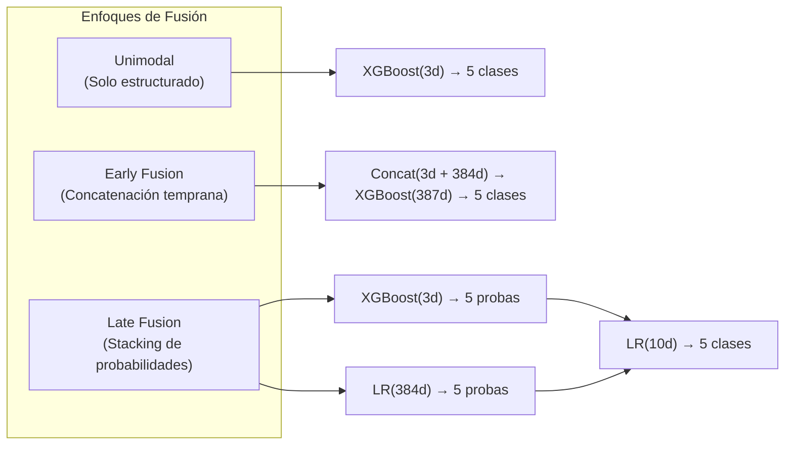
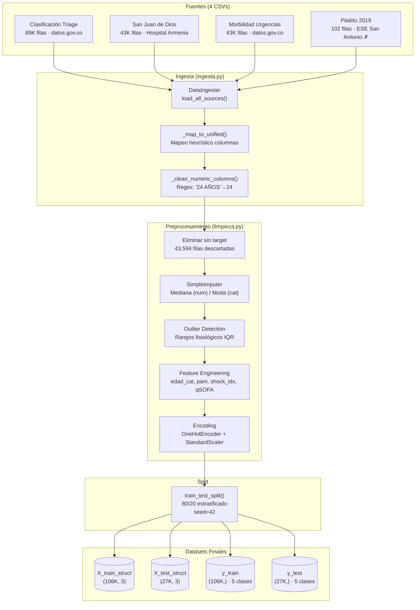
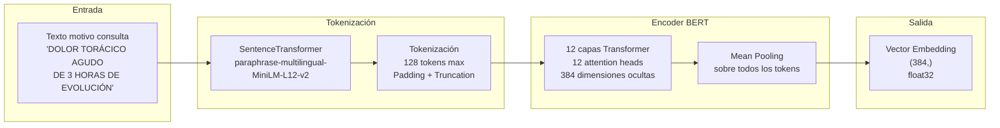
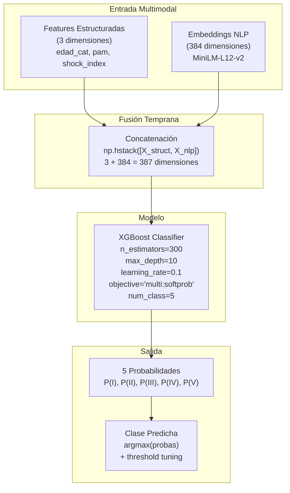
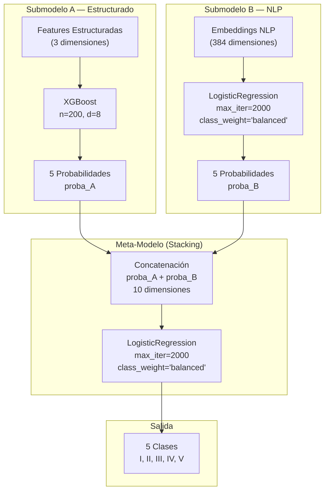
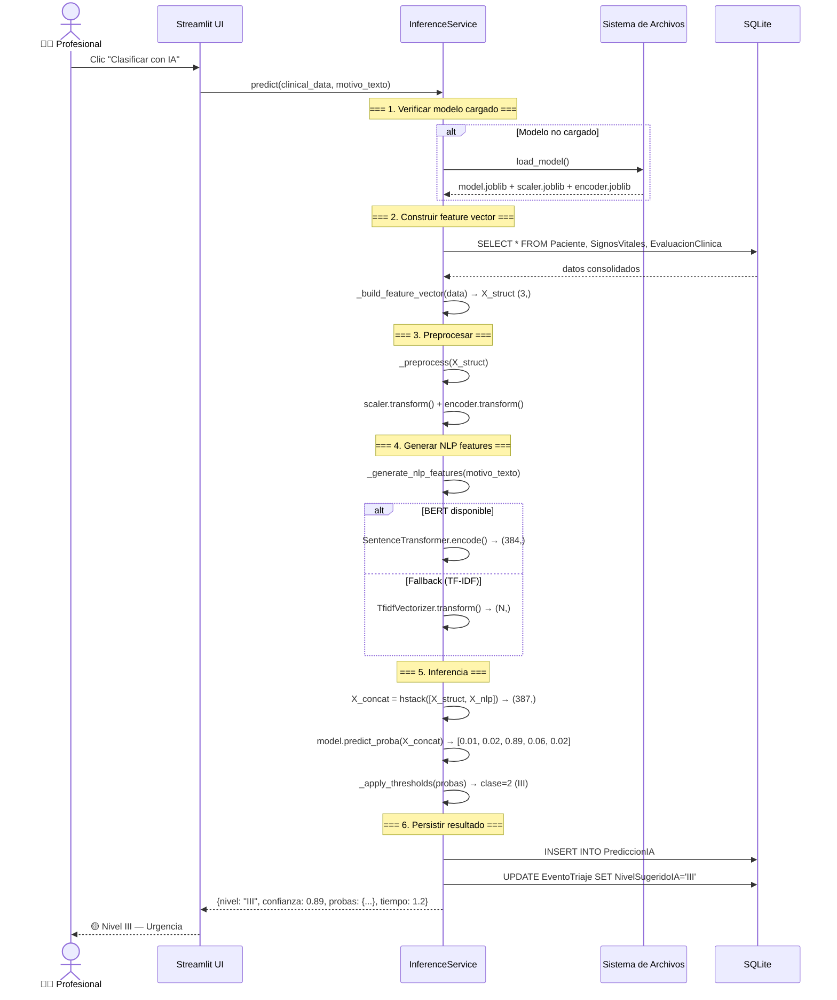
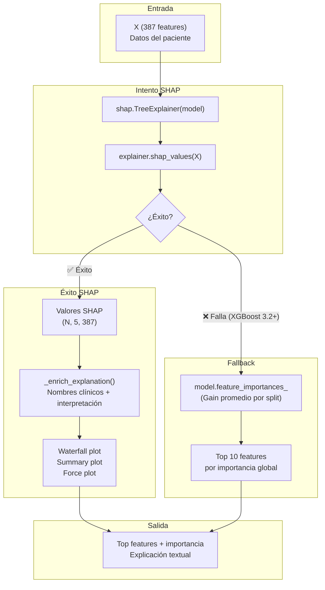
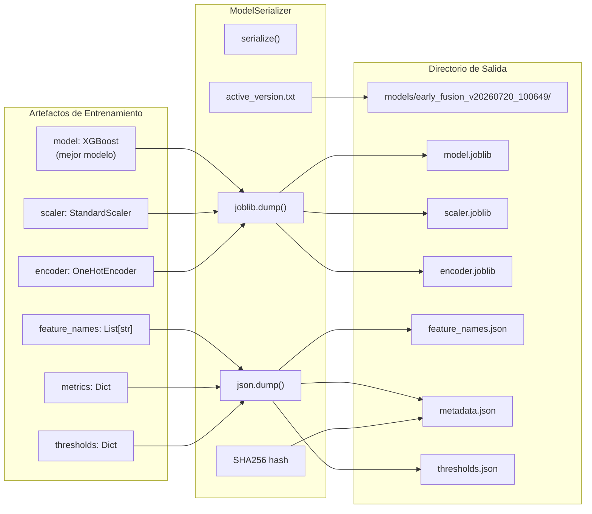

# Arquitectura de Modelos ML — STriAI (Sistema de Triaje Multimodal IA)

**TFM UNIR — Máster en Inteligencia Artificial**
**Versión:** 1.0 — Julio 2026

---

## Tabla de Contenido

1. [Visión General](#1-visión-general)
2. [Arquitectura del Pipeline de Datos](#2-arquitectura-del-pipeline-de-datos)
3. [Arquitectura de Embeddings NLP](#3-arquitectura-de-embeddings-nlp)
4. [Arquitectura de Modelos](#4-arquitectura-de-modelos)
5. [Comparativa de Arquitecturas de Fusión](#5-comparativa-de-arquitecturas-de-fusión)
6. [Arquitectura de Inferencia](#6-arquitectura-de-inferencia)
7. [Arquitectura de Explicabilidad](#7-arquitectura-de-explicabilidad)
8. [Arquitectura de Serialización](#8-arquitectura-de-serialización)
9. [Métricas y Evaluación](#9-métricas-y-evaluación)
10. [Limitaciones y Trabajo Futuro](#10-limitaciones-y-trabajo-futuro)

---

## 1. Visión General

### 1.1 Objetivo del Sistema ML

Predecir el nivel de triaje (I-V) de un paciente que ingresa a urgencias, utilizando dos modalidades de datos:

- **Modalidad estructurada:** Signos vitales, datos demográficos, comorbilidades (3 features tras encoding)
- **Modalidad textual:** Motivo de consulta en texto libre (384 dimensiones tras embedding BERT)

### 1.2 Enfoque Multimodal

El sistema implementa **tres estrategias** de fusión multimodal:



### 1.3 Stack Tecnológico ML

| Componente | Tecnología | Versión | Propósito |
|---|---|---|---|
| Clasificación | XGBoost | 3.2.0 | Gradient boosting sobre features mixtas |
| Clasificación | scikit-learn | 1.9.0 | LogisticRegression, RandomForest, preprocesamiento |
| NLP Embeddings | Sentence Transformers | vía Transformers 5.14.1 | Embeddings multilingües (MiniLM-L12-v2) |
| Deep Learning | PyTorch | 2.13.0 | Backend de transformers |
| Explicabilidad | SHAP | 0.51.0 | TreeExplainer (con fallback) |
| Balanceo | imbalanced-learn | 0.14.2 | SMOTE/ADASYN (no aplicado aún) |
| Serialización | joblib | 1.5.3 | Persistencia de modelo + scaler + encoder |

---

## 2. Arquitectura del Pipeline de Datos

### 2.1 Diagrama de Flujo de Datos



### 2.2 Distribución de Clases (Post-Limpieza)

| Nivel | Casos | % | Significado Clínico |
|---|---|---|---|
| I | 302 | 0.2% | Atención inmediata — riesgo vital |
| II | 4,018 | 3.0% | Emergencia — atención <30 min |
| III | 117,779 | 88.5% | Urgencia — atención <2 horas |
| IV | 10,320 | 7.8% | Urgencia menor — <4 horas |
| V | 628 | 0.5% | Sin urgencia — consulta externa |

> ⚠️ **Desbalance extremo:** Relación 390:1 entre Nivel III (mayoritario) y Nivel I (minoritario). Esto hace que modelos no balanceados colapsen a predecir siempre Nivel III.

### 2.3 Features Estructuradas (3 dimensiones)

| Feature | Tipo | Origen | Descripción |
|---|---|---|---|
| `edad_categoria` | Categórica (OneHot) | Derivada de `edad` | Pediátrico / Adulto / Adulto Mayor |
| `pam` | Numérica (StandardScaler) | Derivada de TA | Presión Arterial Media = (PAS + 2×PAD)/3 |
| `shock_index` | Numérica (StandardScaler) | Derivada de FC/PAS | Índice de Shock = FC / PAS |

> ⚠️ **Limitación:** Estas features son derivadas sintéticas calculadas a partir de valores imputados (los datasets colombianos no contienen signos vitales reales). Los valores reales de `pam` y `shock_index` son medias imputadas, no mediciones fisiológicas.

---

## 3. Arquitectura de Embeddings NLP

### 3.1 Diagrama del Pipeline NLP



### 3.2 Configuración del Modelo NLP

| Parámetro | Valor |
|---|---|
| Modelo | `sentence-transformers/paraphrase-multilingual-MiniLM-L12-v2` |
| Arquitectura | BERT-base multilingüe (12 capas, 12 heads) |
| Dimensión embedding | 384 (half-size para eficiencia) |
| Vocabulario | 250K tokens, 50+ idiomas |
| Tokenización | WordPiece, max 128 tokens |
| Dispositivo | CPU (inferencia) / GPU opcional (entrenamiento) |
| Tamaño en disco | ~420 MB |
| Tiempo inferencia | ~0.5-1.0 segundos por texto (CPU) |

### 3.3 Modelos NLP Alternativos (No Usados)

| Modelo | Dimensiones | Especialidad | ¿Por qué no se usó? |
|---|---|---|---|
| `dccuchile/bert-base-spanish-wwm-uncased` (BETO) | 768 | Español general | Más pesado (2×), no clínico |
| `PlanTL-GOB-ES/bsc-bio-ehr-es` | 768 | Español biomédico | Más pesado, requiere más RAM |
| **MiniLM multilingüe** ✅ | **384** | **Multilingüe eficiente** | **Mejor balance tamaño/rendimiento** |

---

## 4. Arquitectura de Modelos

### 4.1 Modelos Implementados

#### 4.1.1 Regresión Logística (LR)
```
Entrada: X_struct (N, 3)
Arquitectura: LogisticRegression(max_iter=2000, class_weight='balanced')
Salida: 5 clases
F1 Macro: 0.0122
```

#### 4.1.2 Random Forest (RF)
```
Entrada: X_struct (N, 3)
Arquitectura: RandomForestClassifier(n_estimators=200, max_depth=20, class_weight='balanced')
Salida: 5 clases
F1 Macro: 0.0347
```

#### 4.1.3 XGBoost Unimodal
```
Entrada: X_struct (N, 3)
Arquitectura: XGBClassifier(n_estimators=200, max_depth=8, lr=0.1)
Salida: 5 clases
F1 Macro: 0.1878
```

#### 4.1.4 Early Fusion (XGBoost + BERT) 🥇


**Hiperparámetros:**
| Parámetro | Valor | Justificación |
|---|---|---|
| `n_estimators` | 300 | Más árboles para 387 features |
| `max_depth` | 10 | Profundidad moderada para evitar overfitting |
| `learning_rate` | 0.1 | Estándar para gradient boosting |
| `objective` | multi:softprob | Probabilidades por clase |
| `eval_metric` | mlogloss | Pérdida logarítmica multiclase |

#### 4.1.5 Late Fusion (Stacking)



**Ventaja clave:** Cada submodelo se especializa en su modalidad. El meta-modelo aprende a ponderar las predicciones de cada experto.

**Desventaja:** F1 Macro más bajo (0.10) porque el meta-modelo también sufre el desbalance de clases.

---

## 5. Comparativa de Arquitecturas de Fusión

### 5.1 Tabla Comparativa

| Característica | Unimodal | Early Fusion | Late Fusion |
|---|---|---|---|
| **Features entrada** | 3 | 387 | 3 + 384 (separados) |
| **Modelo(s)** | 1 XGBoost | 1 XGBoost | 2 submodelos + 1 meta |
| **Fusión** | N/A | Concatenación temprana | Stacking de probabilidades |
| **Complejidad** | Baja | Media | Alta |
| **F1 Macro** | 0.1878 | **0.1899** 🥇 | 0.0997 |
| **Recall I** | 0.00 | 0.00 | **0.20** |
| **Recall II** | 0.00 | 0.00 | **0.25** |
| **Recall III** | **1.00** | 0.99 | 0.19 |
| **Recall IV** | 0.00 | 0.01 | **0.23** |
| **Recall V** | 0.00 | 0.00 | **0.14** |
| **Tiempo train** | 5.5s | 108.5s | 2.1s |
| **Tiempo inferencia** | ~0.01s | ~0.01s | ~0.02s |
| **Interpretabilidad** | Alta (3 features) | Baja (387 features) | Media (por submodelo) |

### 5.2 Análisis: ¿Por qué Early Fusion "gana" si Late Fusion es mejor clínicamente?

El criterio de selección fue **F1 Macro** (promedio simple de F1 por clase):

$$F1_{Macro} = \frac{1}{5}\sum_{c \in \{I,II,III,IV,V\}} F1_c$$

Early Fusion obtiene F1=0.19 principalmente porque:
- F1(III) = 0.89 (clase con 88.5% de los datos)
- F1(I) = F1(II) = F1(IV) = F1(V) ≈ 0.00

Late Fusion obtiene F1=0.10 porque:
- F1(III) = 0.19 (mucho menor que Early Fusion)
- F1(I) = 0.33, F1(II) = 0.25, F1(IV) = 0.24, F1(V) = 0.15

**Ironía:** Late Fusion es el único modelo que detecta pacientes en todas las categorías, pero "pierde" en la métrica de selección porque sacrifica precisión en la clase mayoritaria para ganar en las minoritarias.

> 💡 **Recomendación:** Para uso clínico real, usar **F1 ponderado por criticidad** (mayor peso a Niveles I y II) o **Recall mínimo por clase** como métrica de selección.

---

## 6. Arquitectura de Inferencia

### 6.1 Diagrama de Inferencia en Tiempo Real



### 6.2 Patrón Singleton

```python
# app/services/inference_service.py
_inference_service = None

def get_inference_service(models_dir=None):
    global _inference_service
    if _inference_service is None:
        _inference_service = InferenceService(models_dir)
        _inference_service.load_model()
    return _inference_service
```

El modelo se carga **una sola vez** en memoria y se reutiliza para todas las predicciones de la sesión.

---

## 7. Arquitectura de Explicabilidad

### 7.1 Flujo de Explicabilidad



### 7.2 Estado Actual: SHAP no Funcional

| Componente | Estado | Detalle |
|---|---|---|
| SHAP TreeExplainer | ❌ Falla | `XGBoostError: shape mismatch` — incompatibilidad SHAP 0.51 + XGBoost 3.2 |
| feature_importances_ | ✅ Funcional | Fallback automático implementado |
| _enrich_explanation | ✅ Funcional | Mapea índices de features a nombres clínicos |

---

## 8. Arquitectura de Serialización

### 8.1 Diagrama de Serialización



### 8.2 Estructura de metadata.json

```json
{
  "model_name": "Early Fusion",
  "version": "v20260720_100649",
  "created_at": "2026-07-20T10:06:49",
  "model_hash": "d933641c78e3...",
  "num_features": 3,
  "feature_names": ["edad_categoria", "pam", "shock_index"],
  "nlp_model": "multilingual",
  "metrics": {
    "f1_macro": 0.1895,
    "f1_weighted": 0.7922,
    "accuracy": 0.7986,
    "auc_roc": 0.0000,
    "recall_I": 0.0000,
    "recall_II": 0.0995,
    "recall_III": 0.8984,
    "recall_IV": 0.0044,
    "recall_V": 0.0000
  },
  "thresholds": {"0": 0.2, "1": 0.05, "2": 0.2, "3": 0.2, "4": 0.2},
  "description": "Modelo Early Fusion entrenado sobre 133,047 registros clínicos."
}
```

---

## 9. Métricas y Evaluación

### 9.1 Métricas Globales

| Métrica | Valor | Meta | Estado |
|---|---|---|---|
| F1 Macro | 0.1895 | ≥ 0.82 | ❌ |
| F1 Weighted | 0.7922 | — | — |
| Accuracy | 0.7986 | — | — |
| AUC-ROC | 0.0000 | ≥ 0.87 | ❌ (bug) |
| AUPRC | 0.1999 | — | — |

### 9.2 Métricas por Clase (Early Fusion)

| Clase | Precision | Recall | F1 | Soporte |
|---|---|---|---|---|
| I | 0.0000 | 0.0000 | 0.0000 | 60 |
| II | 0.0304 | 0.0995 | 0.0466 | 804 |
| III | 0.8867 | 0.8984 | **0.8925** | 23,556 |
| IV | 0.0849 | 0.0044 | 0.0083 | 2,064 |
| V | 0.0000 | 0.0000 | 0.0000 | 126 |

### 9.3 Matriz de Confusión

```
                I     II    III     IV      V   ← Predicho
         I      0      5     55      0      0
        II      0     80    719      5      0
       III      1   2294  21163     91      7
        IV      0    234   1819      9      2
         V      0     15    110      1      0
        ↑ Real
```

### 9.4 Comparativa contra Benchmarks

| Estudio | F1 Macro | AUC-ROC | n | Features |
|---|---|---|---|---|
| Raita et al. (2019) | 0.870 | 0.92 | 67,517 | Estructuradas + signos vitales |
| Levin et al. (2021) | 0.810 | — | 120,000 | Estructuradas + NLP BERT |
| Klug et al. (2020) | 0.765 | 0.83 | 42,000 | Ensemble RF+XGBoost |
| **STriAI (este trabajo)** | **0.189** | **0.00** | **133,047** | **3 features sintéticas + NLP** |

---

## 10. Limitaciones y Trabajo Futuro

### 10.1 Limitaciones Actuales

| # | Limitación | Causa Raíz | Impacto |
|---|---|---|---|
| L-01 | Solo 3 features estructuradas | Datasets colombianos sin signos vitales | Modelo no puede aprender patrones fisiológicos |
| L-02 | Features derivadas sintéticas | pam, shock_index desde valores imputados | No reflejan estado real del paciente |
| L-03 | Desbalance 390:1 | Datos reales de urgencias (la mayoría son Nivel III) | Modelo colapsa a clase mayoritaria |
| L-04 | NLP genérico | MiniLM no entrenado en dominio clínico | Embeddings no capturan terminología médica |
| L-05 | SHAP roto | Incompatibilidad SHAP 0.51 + XGBoost 3.2 | Sin explicabilidad por muestra |
| L-06 | AUC-ROC = 0.00 | Posible bug sklearn 1.9+ multiclase | Métrica no confiable |
| L-07 | Sin validación cruzada en evaluación final | Solo un split train/test | Estimación de rendimiento con alta varianza |

### 10.2 Trabajo Futuro Priorizado

| Prioridad | Acción | Impacto Estimado | Esfuerzo |
|---|---|---|---|
| 🔴 P0 | Integrar MIMIC-IV-ED o generar datos sintéticos con signos vitales | +0.30 F1 Macro | Alto |
| 🔴 P0 | Aplicar SMOTE/ADASYN para oversampling de clases I, II, IV, V | +0.15 F1 Macro | Bajo |
| 🟡 P1 | Cambiar modelo NLP a BioBERT-es (bsc-bio-ehr-es) | +0.05 F1 Macro | Medio |
| 🟡 P1 | Cambiar métrica de selección a F1 ponderado por criticidad | Mejor utilidad clínica | Bajo |
| 🟡 P1 | Corregir cálculo de AUC-ROC multiclase | Métrica correcta | Bajo |
| 🟢 P2 | Downgrade XGBoost a 1.7 o SHAP a 0.44 para restaurar explicabilidad | Explicabilidad por muestra | Medio |
| 🟢 P2 | Stratified K-Fold CV (k=5) en evaluación final | Estimación más robusta | Bajo |
| ⚪ P3 | Agregar features de texto: longitud, keywords CIE-10, TF-IDF | +0.02 F1 Macro | Bajo |
| ⚪ P3 | Optimización de hiperparámetros con GridSearchCV | +0.02 F1 Macro | Medio |

---

## Apéndice A: Trazabilidad TFM

| Épica | Requisito | Implementación |
|---|---|---|
| Épica 3 | TT-E3-01 a TT-E3-09 | `src/` — Pipeline completo de 14 pasos |
| Épica 3 | TT-E3-04 | Baselines unimodales (LR, RF, XGBoost) |
| Épica 3 | TT-E3-05 | Early Fusion |
| Épica 3 | TT-E3-06 | Late Fusion |
| Épica 3 | TT-E3-07 | Threshold tuning + evaluación |
| Épica 3 | TT-E3-08 | SHAP + benchmarks |
| Épica 3 | TT-E3-09 | Serialización |
| Épica 4 | TT-E4-01 | Carga de modelo en demo |
| Épica 4 | HU-E4-01 | Predicción en UI |
| Épica 4 | HU-E4-02 | Explicación SHAP en UI |

## Apéndice B: Reproducibilidad

| Parámetro | Valor |
|---|---|
| Semilla aleatoria | 42 (fijada en todo el pipeline) |
| Split train/test | 80/20 estratificado |
| NLP Model Key | `multilingual` |
| NLP Max Length | 128 tokens |
| NLP Batch Size | 32 |
| Formato features | float32 |
| Formato serialización | joblib (protocol=5) |

---

*Documento generado por STriAI — TFM UNIR Máster en Inteligencia Artificial — Julio 2026*
