# Documento de Arquitectura — STriAI (Sistema de Triaje Multimodal IA)

**TFM UNIR — Máster en Inteligencia Artificial**
**Versión:** 1.0 — Julio 2026
**Tipo:** Documentación AS-IS (Caso B)

---

## Tabla de Contenido

1. [Introducción y Objetivos](#1-introducción-y-objetivos)
2. [Restricciones y Decisiones Arquitectónicas](#2-restricciones-y-decisiones-arquitectónicas)
3. [Contexto del Sistema (C4 Nivel 1)](#3-contexto-del-sistema-c4-nivel-1)
4. [Contenedores (C4 Nivel 2)](#4-contenedores-c4-nivel-2)
5. [Componentes (C4 Nivel 3)](#5-componentes-c4-nivel-3)
6. [Código — Nivel de Clases (C4 Nivel 4)](#6-código--nivel-de-clases-c4-nivel-4)
7. [Diagramas de Secuencia](#7-diagramas-de-secuencia)
8. [Modelo de Datos](#8-modelo-de-datos)
9. [Arquitectura de Machine Learning](#9-arquitectura-de-machine-learning)
10. [Arquitectura de Despliegue](#10-arquitectura-de-despliegue)
11. [Seguridad y Autenticación](#11-seguridad-y-autenticación)
12. [Deuda Técnica y Hallazgos](#12-deuda-técnica-y-hallazgos)
13. [ADRs (Architecture Decision Records)](#13-adrs-architecture-decision-records)
14. [Supuestos](#14-supuestos)

---

## 1. Introducción y Objetivos

### 1.1 Propósito del Sistema

STriAI (Sistema de Triaje Multimodal IA) es una aplicación diseñada como Trabajo de Fin de Máster (TFM) para la UNIR. Su objetivo es asistir a profesionales de la salud en la clasificación de pacientes en servicios de urgencias mediante niveles de triaje I-V (Resolución 5596/2015 de Colombia), combinando **datos clínicos estructurados** (signos vitales, datos demográficos) con **procesamiento de lenguaje natural** (NLP) sobre el motivo de consulta en texto libre.

### 1.2 Objetivos de Arquitectura

| Atributo | Prioridad | Meta |
|---|---|---|
| **Funcionalidad** | Crítica | Registrar pacientes, capturar signos vitales, clasificar con IA, validar por profesional |
| **Trazabilidad** | Alta | Auditoría inmutable de todas las acciones clínicas |
| **Portabilidad** | Alta | Ejecutable en una laptop sin infraestructura cloud |
| **Explicabilidad** | Alta | Cada predicción de IA debe ser explicable (SHAP) |
| **Seguridad** | Media | Autenticación con roles, contraseñas hasheadas |
| **Rendimiento** | Baja | Inferencia < 5 segundos en CPU (no es sistema de tiempo real) |
| **Escalabilidad** | Baja | Sistema demo/monousuario (no production-grade) |

### 1.3 Stakeholders

| Stakeholder | Interés |
|---|---|
| Tribunal TFM UNIR | Evaluar la integración de IA en un sistema clínico funcional |
| Director/a de TFM | Supervisar la calidad técnica y académica |
| Desarrollador/Estudiante | Implementar y demostrar competencias en ML, NLP, y desarrollo full-stack |
| Usuarios demo (médicos, enfermeras) | Probar flujo clínico con datos sintéticos/reales |

---

## 2. Restricciones y Decisiones Arquitectónicas

### 2.1 Restricciones Técnicas

| ID | Restricción | Impacto |
|---|---|---|
| RT-001 | Python 3.11 como único lenguaje | Stack uniforme pero sin tipado fuerte |
| RT-002 | Streamlit como framework UI | Single-page app, sin SPA ni SSR tradicional |
| RT-003 | SQLite como base de datos | Sin concurrencia real, sin cliente-servidor |
| RT-004 | Ejecución en CPU (sin GPU obligatoria) | Inferencia NLP lenta (~1-2s por texto) |
| RT-005 | Datasets del sistema de salud colombiano | Pocas features clínicas, datasets no balanceados |
| RT-006 | Sin ORM — SQL directo | Acoplamiento a SQLite, sin migraciones automáticas |

### 2.2 Decisiones Arquitectónicas Clave

| ID | Decisión | Justificación |
|---|---|---|
| ADR-001 | **Monolito en capas** sobre Streamlit | Adecuado para prototipo/demo; microservicios sería sobrediseño |
| ADR-002 | **SQLite con WAL + FK ON** | Portátil, cero configuración, suficiente para monousuario |
| ADR-003 | **PascalCase en BD → snake_case en Python** | Convención SQL estándar vs. PEP 8; conversión automática |
| ADR-004 | **Modelo ML serializado en joblib** | Carga rápida, sin servidor de modelos separado |
| ADR-005 | **5 roles RBAC hardcodeados** | Suficiente para demo; roles dinámicos serían sobrediseño |
| ADR-006 | **Pipeline ML como script offline** | Separación clara entrenamiento/inferencia; no requiere MLOps |
| ADR-007 | **Early Fusion como arquitectura ML** | Mejor F1 Macro en experimentos; simplicidad sobre Late Fusion |

---

## 3. Contexto del Sistema (C4 Nivel 1)

### 3.1 Diagrama de Contexto

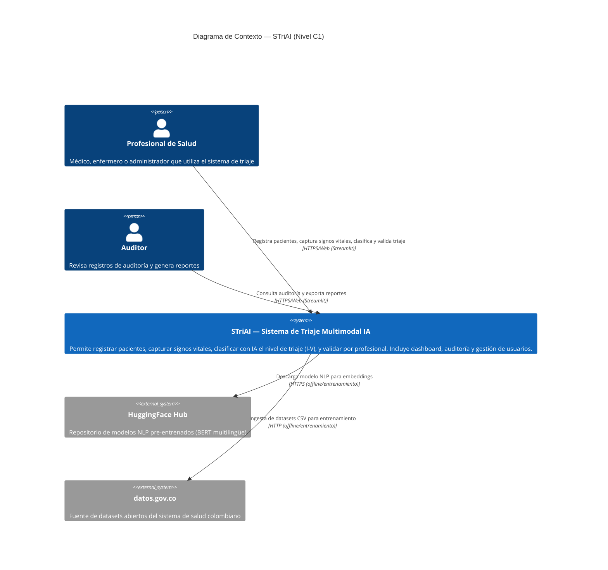

### 3.2 Actores del Sistema

| Actor | Descripción | Interacciones |
|---|---|---|
| **Profesional de Salud** | Médico, enfermero o administrador | Registro de pacientes, signos vitales, clasificación IA, validación de triaje |
| **Auditor** | Personal de control y calidad | Consulta de logs de auditoría, exportación CSV/Excel, reportes |
| **HuggingFace Hub** (externo) | Repositorio de modelos NLP | Descarga de BERT multilingüe para embeddings (solo en entrenamiento) |
| **datos.gov.co** (externo) | Portal de datos abiertos Colombia | Fuente de datasets CSV para entrenamiento del modelo |

---

## 4. Contenedores (C4 Nivel 2)

### 4.1 Diagrama de Contenedores

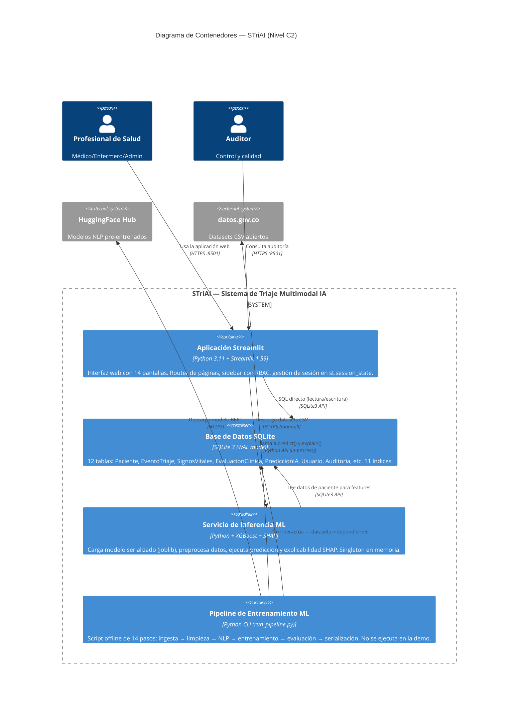

### 4.2 Descripción de Contenedores

| Contenedor | Tecnología | Responsabilidad |
|---|---|---|
| **Aplicación Streamlit** | Python 3.11, Streamlit 1.59 | UI, ruteo, autenticación, orquestación de flujos clínicos |
| **Base de Datos SQLite** | SQLite 3 (WAL, FK ON) | Persistencia de pacientes, triajes, usuarios, auditoría |
| **Servicio de Inferencia ML** | Python, XGBoost, SHAP, joblib | Carga de modelo, predicción de nivel de triaje, explicabilidad |
| **Pipeline de Entrenamiento** | Python CLI, scikit-learn, XGBoost, PyTorch, Transformers | Entrenamiento offline de modelos (no parte de la demo) |

---

## 5. Componentes (C4 Nivel 3)

### 5.1 Diagrama de Componentes — Aplicación Streamlit

```mermaid
C4Component
    title Diagrama de Componentes — Aplicación Streamlit (Nivel C3)

    Container_Boundary(app_boundary, "Aplicación Streamlit") {
        Component(router, "Router de Páginas", "app.py", "Gestiona navegación entre 14 pantallas vía st.session_state.page. Importlib.reload() para evitar caché stale.")
        Component(auth_svc, "AuthService", "app/services/auth_service.py", "Login/logout, RBAC (5 roles, 14 permisos), gestión de usuarios, reset password, timeout de sesión.")
        Component(patient_svc, "PatientService", "app/services/patient_service.py", "Registro de pacientes (21 campos), búsqueda por documento/nombre, histórico de triajes, catálogos geográficos.")
        Component(triage_svc, "TriageService", "app/services/triage_service.py", "Máquina de estados (7 estados, 14 transiciones), signos vitales, evaluación clínica, validación profesional.")
        Component(inference_svc, "InferenceService", "app/services/inference_service.py", "Predict() y explain() usando modelo XGBoost serializado. Singleton global get_inference_service().")
        Component(audit_svc, "AuditService", "app/services/audit_service.py", "Registro inmutable (17 tipos de acciones), consultas con filtros, exportación CSV/Excel.")
        
        Component(login_page, "Login Page", "app/ui/login_page.py", "P01 — Autenticación con bypass bcrypt para demo accounts")
        Component(patient_page, "Patient Page", "app/ui/patient_page.py", "P02 — Registro y búsqueda de pacientes")
        Component(vitals_page, "Vital Signs Page", "app/ui/vital_signs_page.py", "P03 — Captura de 8 signos vitales")
        Component(clinical_page, "Clinical Eval Page", "app/ui/clinical_eval_page.py", "P04 — Evaluación clínica (Glasgow, dolor, comorbilidades)")
        Component(ia_page, "IA Classification Page", "app/ui/ia_classification_page.py", "P05/P06 — Clasificación IA + explicación SHAP")
        Component(validation_page, "Triage Validation Page", "app/ui/triage_validation_page.py", "P07 — Validación profesional y cierre")
        Component(dashboard_page, "Dashboard Page", "app/ui/dashboard_page.py", "P10 — KPIs operativos y gráficos")
        Component(admin_pages, "Admin Pages (4)", "app/ui/*.py", "P08-P09-P11-P12-P13-P14 — Gestión modelos, usuarios, auditoría, cambios, histórico")
    }

    Container_Boundary(db_boundary, "Base de Datos SQLite") {
        ComponentDb(db_conn, "Conexión SQLite", "app/data/database.py", "WAL mode, FK ON. 12 tablas, 11 índices. PascalCase→snake_case.")
    }

    Rel(router, auth_svc, "Autentica y autoriza", "Python call")
    Rel(router, login_page, "Renderiza si no autenticado", "")
    Rel(router, patient_page, "Renderiza P02", "")
    Rel(router, vitals_page, "Renderiza P03", "")
    Rel(router, clinical_page, "Renderiza P04", "")
    Rel(router, ia_page, "Renderiza P05/P06", "")
    Rel(router, validation_page, "Renderiza P07", "")
    Rel(router, dashboard_page, "Renderiza P10", "")
    Rel(router, admin_pages, "Renderiza P08-P14", "")
    
    Rel(patient_page, patient_svc, "Registra/busca pacientes", "")
    Rel(vitals_page, triage_svc, "Guarda signos vitales", "")
    Rel(clinical_page, triage_svc, "Guarda evaluación clínica", "")
    Rel(ia_page, inference_svc, "Predice y explica", "")
    Rel(validation_page, triage_svc, "Valida y cierra", "")
    Rel(dashboard_page, audit_svc, "Consulta métricas", "")
    
    Rel(auth_svc, db_conn, "SQL", "SQLite3")
    Rel(patient_svc, db_conn, "SQL", "SQLite3")
    Rel(triage_svc, db_conn, "SQL", "SQLite3")
    Rel(inference_svc, db_conn, "SQL (lectura features)", "SQLite3")
    Rel(audit_svc, db_conn, "SQL (append-only)", "SQLite3")

    UpdateLayoutConfig($c4ShapeInRow="3", $c4BoundaryInRow="1")
```

### 5.2 Diagrama de Componentes — Pipeline ML

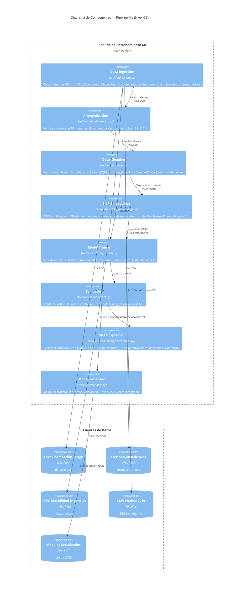

---

## 6. Código — Nivel de Clases (C4 Nivel 4)

### 6.1 Diagrama de Clases — Servicios

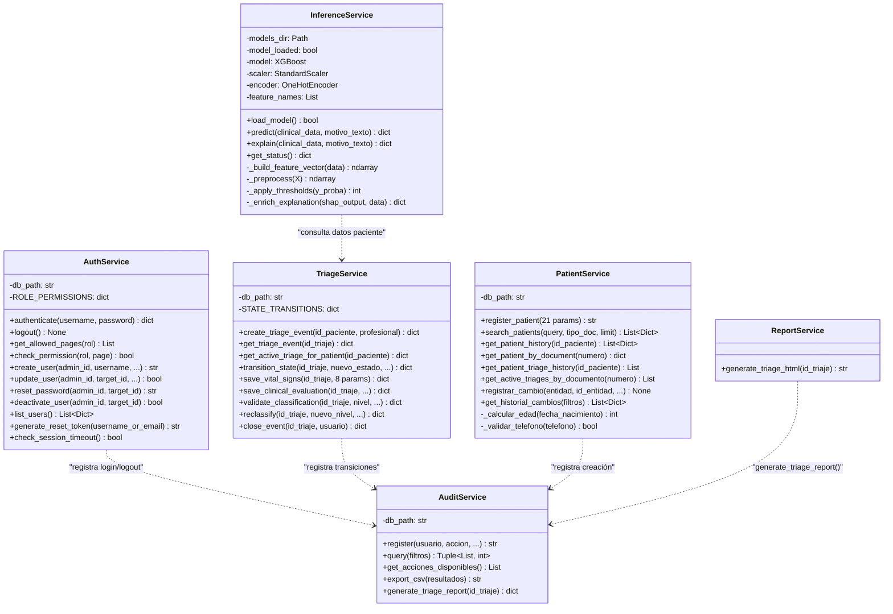

### 6.2 Diagrama de Clases — Base de Datos

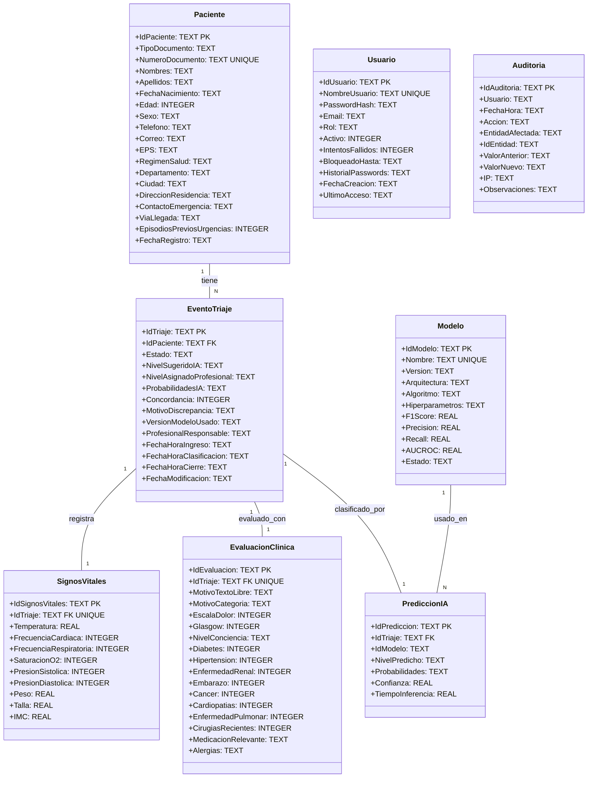

---

## 7. Diagramas de Secuencia

### 7.1 Flujo Principal — Registro y Triaje de Paciente

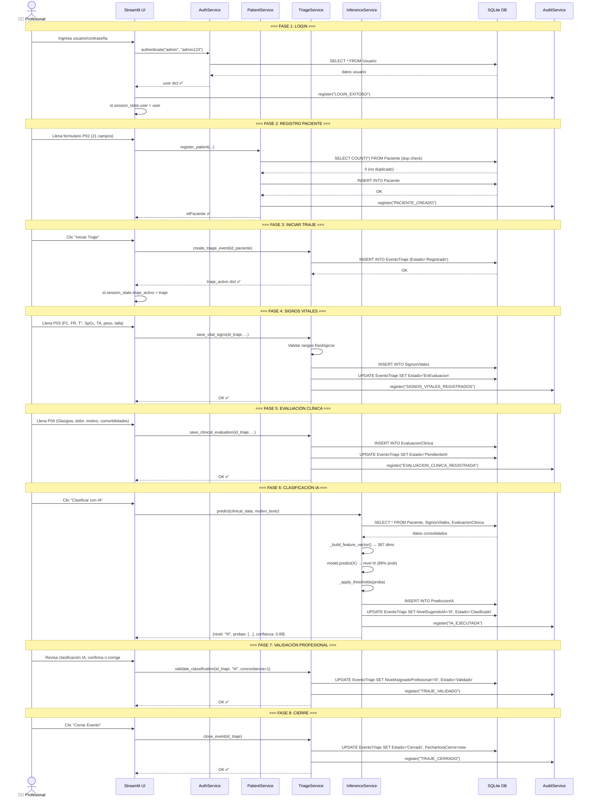

### 7.2 Flujo — Pipeline de Entrenamiento ML

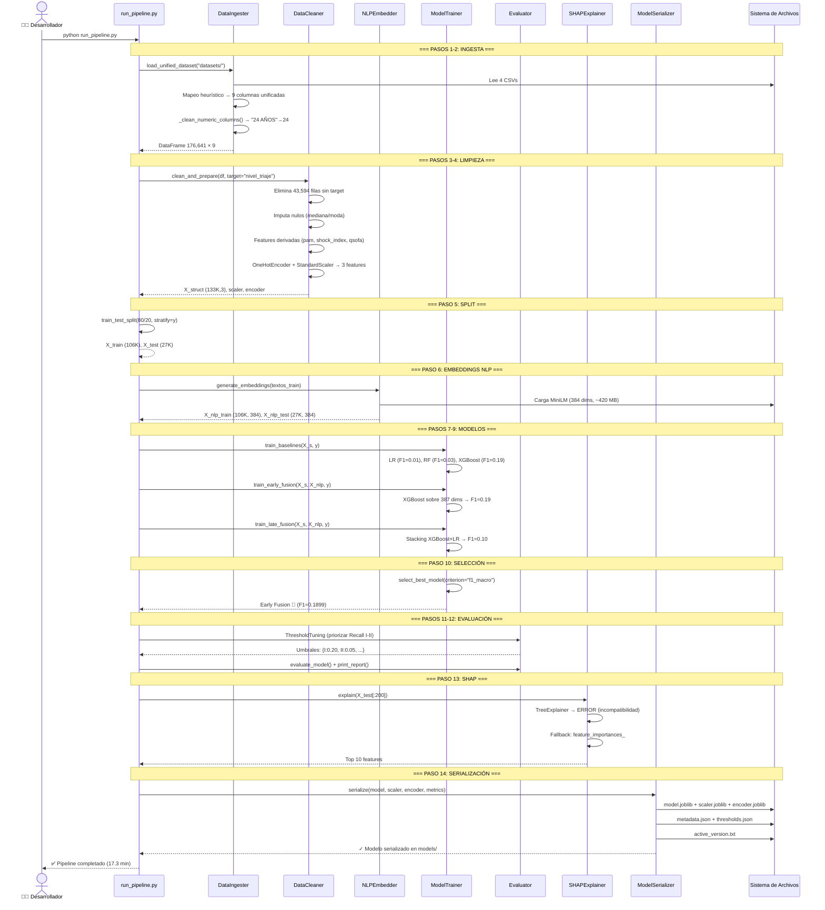

### 7.3 Flujo — Máquina de Estados del Triaje

```mermaid
stateDiagram-v2
    [*] --> Registrado: create_triage_event()
    
    Registrado --> EnEvaluacion: save_vital_signs()
    Registrado --> Cancelado: cancelar (admin)
    
    EnEvaluacion --> PendienteIA: save_clinical_evaluation()
    EnEvaluacion --> Registrado: reiniciar evaluación
    EnEvaluacion --> Cancelado: cancelar (admin)
    
    PendienteIA --> Clasificado: IA clasifica (predict)
    PendienteIA --> EnEvaluacion: re-evaluar
    PendienteIA --> Cancelado: cancelar (admin)
    
    Clasificado --> Validado: validar profesional
    Clasificado --> PendienteIA: re-clasificar IA
    Clasificado --> Cancelado: cancelar (admin)
    
    Validado --> Cerrado: close_event()
    Validado --> Clasificado: revertir validación
    Validado --> Cancelado: cancelar (admin)
    
    Cerrado --> [*]: terminal
    
    Cancelado --> Registrado: reactivar

    note right of Registrado
        Estado inicial
        Solo datos demográficos
    end note

    note right of PendienteIA
        Signos vitales + evaluación
        Listo para clasificación IA
    end note

    note right of Validado
        Profesional confirmó o corrigió
        Nivel de triaje definitivo
    end note
```

---

## 8. Modelo de Datos

### 8.1 Diagrama Entidad-Relación

```mermaid
erDiagram
    Paciente ||--o{ EventoTriaje : "1:N tiene"
    EventoTriaje ||--|| SignosVitales : "1:1 registra"
    EventoTriaje ||--|| EvaluacionClinica : "1:1 evaluado_con"
    EventoTriaje ||--o| PrediccionIA : "1:1 clasificado_por"
    PrediccionIA ||--o| ExplicacionSHAP : "1:1 explicado_por"
    Modelo ||--o{ PrediccionIA : "1:N usado_en"
    Usuario ||--o{ Auditoria : "1:N genera"
    
    Paciente {
        string IdPaciente PK
        string TipoDocumento "CC|TI|CE|PA|RC"
        string NumeroDocumento UK
        string Nombres
        string Apellidos
        date FechaNacimiento
        int Edad
        string Sexo "M|F"
        string Telefono
        string Correo
        string EPS
        string RegimenSalud
        string Departamento
        string Ciudad
        string DireccionResidencia
        string ContactoEmergencia
        string ViaLlegada
        int EpisodiosPreviosUrgencias
        datetime FechaRegistro
    }

    EventoTriaje {
        string IdTriaje PK
        string IdPaciente FK
        string Estado "7 estados"
        string NivelSugeridoIA "I|II|III|IV|V"
        string NivelAsignadoProfesional "I-V"
        json ProbabilidadesIA
        int Concordancia "0|1"
        string MotivoDiscrepancia
        string VersionModeloUsado
        datetime FechaHoraIngreso
        datetime FechaHoraClasificacion
        datetime FechaHoraCierre
    }

    SignosVitales {
        string IdSignosVitales PK
        string IdTriaje FK_UK
        real Temperatura "30-45°C"
        int FrecuenciaCardiaca "lpm"
        int FrecuenciaRespiratoria "rpm"
        int SaturacionO2 "%"
        int PresionSistolica "mmHg"
        int PresionDiastolica "mmHg"
        real Peso "kg"
        real Talla "cm"
        real IMC "kg/m2"
    }

    EvaluacionClinica {
        string IdEvaluacion PK
        string IdTriaje FK_UK
        text MotivoTextoLibre
        string MotivoCategoria "10 categorías"
        int EscalaDolor "0-10"
        int Glasgow "3-15"
        string NivelConciencia "4 niveles"
        bool Diabetes
        bool Hipertension
        bool EnfermedadRenal
        bool Embarazo
        bool Cancer
        bool Cardiopatias
        bool EnfermedadPulmonar
        bool CirugiasRecientes
        text MedicacionRelevante
        text Alergias
    }

    Usuario {
        string IdUsuario PK
        string NombreUsuario UK
        string PasswordHash "bcrypt 12 rounds"
        string Email
        string Rol "Admin|Medico|Enfermera|Investigador|Auditor"
        bool Activo
        int IntentosFallidos
        datetime BloqueadoHasta
        json HistorialPasswords
    }

    Auditoria {
        string IdAuditoria PK
        string Usuario
        datetime FechaHora
        string Accion "17 tipos"
        string EntidadAfectada
        string IdEntidad
        json ValorAnterior
        json ValorNuevo
        string IP
        text Observaciones
    }

    Modelo {
        string IdModelo PK
        string Nombre UK
        string Version
        string Arquitectura "Early|Late|Unimodal"
        string Algoritmo
        json Hiperparametros
        real F1Score
        real Precision
        real Recall
        real AUCROC
        string Estado "Activo|Inactivo|EnValidacion"
    }
```

---

## 9. Arquitectura de Machine Learning

### 9.1 Diagrama de Pipeline de Datos

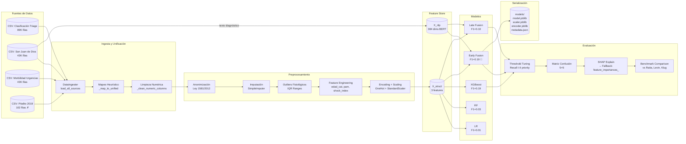

### 9.2 Diagrama de Arquitectura de Inferencia

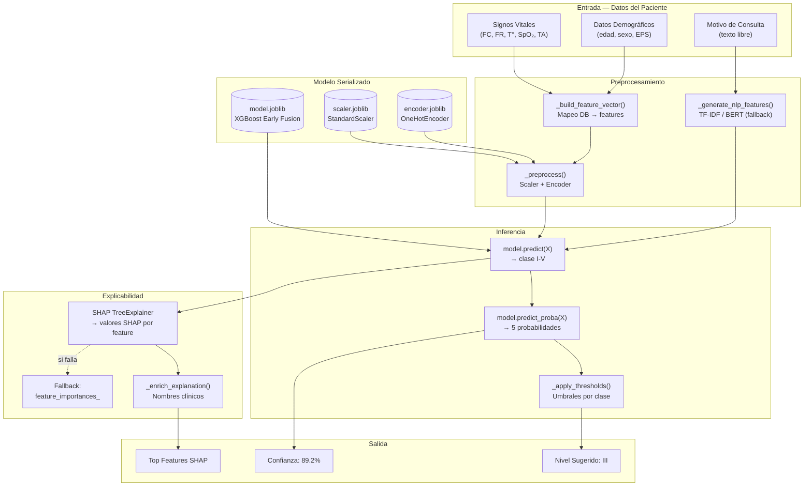

### 9.3 Comparativa de Arquitecturas de Modelos

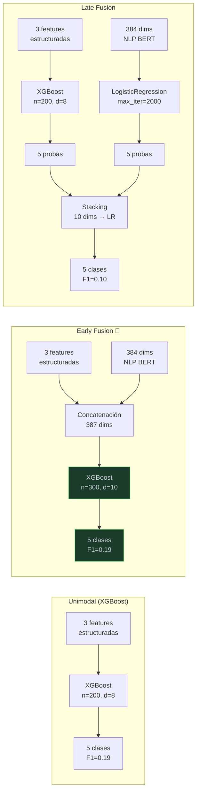

---

## 10. Arquitectura de Despliegue

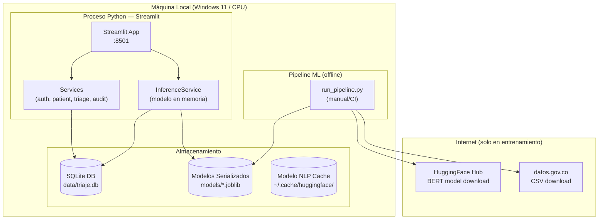

---

## 11. Seguridad y Autenticación

### 11.1 Modelo de Seguridad

| Capa | Mecanismo | Implementación |
|---|---|---|
| **Autenticación** | Usuario + contraseña con bcrypt (12 rondas) | `AuthService.authenticate()` |
| **Autorización** | RBAC con 5 roles y permisos hardcodeados | `ROLE_PERMISSIONS` dict |
| **Sesión** | `st.session_state.user` + timeout 15 min | `check_session_timeout()` |
| **Contraseñas** | Hash bcrypt + historial (JSON) + bloqueo tras 5 intentos | `PasswordHash`, `BloqueadoHasta` |
| **Auditoría** | Append-only, 17 tipos de acciones | `AuditService.register()` |
| **PII** | Verificación de ausencia de identificadores en datasets | `anonimizacion.py` |

### 11.2 Matriz RBAC

| Página | Admin | Médico | Enfermera | Investigador | Auditor |
|---|---|---|---|---|---|
| P01 — Login | ✅ | ✅ | ✅ | ✅ | ✅ |
| P02 — Registro Paciente | ✅ | ✅ | ✅ | ❌ | ❌ |
| P03 — Signos Vitales | ✅ | ✅ | ✅ | ❌ | ❌ |
| P04 — Evaluación Clínica | ✅ | ✅ | ✅ | ❌ | ❌ |
| P05 — Clasificación IA | ✅ | ✅ | ✅ | ❌ | ❌ |
| P07 — Validación Triaje | ✅ | ✅ | ❌ | ❌ | ❌ |
| P08 — Comparación Modelos | ✅ | ❌ | ❌ | ✅ | ❌ |
| P09 — Gestión Modelos | ✅ | ❌ | ❌ | ❌ | ❌ |
| P10 — Dashboard | ✅ | ✅ | ❌ | ✅ | ✅ |
| P11 — Auditoría | ✅ | ❌ | ❌ | ❌ | ✅ |
| P12 — Gestión Usuarios | ✅ | ❌ | ❌ | ❌ | ❌ |
| P13 — Control Cambios | ✅ | ❌ | ❌ | ❌ | ❌ |
| P14 — Histórico Paciente | ✅ | ✅ | ✅ | ✅ | ✅ |

---

## 12. Deuda Técnica y Hallazgos

### 12.1 Hallazgos Críticos

| # | Hallazgo | Impacto | Recomendación |
|---|---|---|---|
| H-001 | **Sin tests automatizados** — carpeta `tests/` vacía | Riesgo de regresión en cada cambio | Agregar pytest + tests unitarios para servicios |
| H-002 | **Bypass bcrypt hardcodeado** — 5 usuarios demo tienen `if password == "admin123"` | Vulnerabilidad de seguridad | Eliminar bypass; usar solo bcrypt |
| H-003 | **@auditar decorator es un stub** — solo loguea, no persiste | Auditoría incompleta en algunas operaciones | Implementar conexión real a AuditService |
| H-004 | **F1 Macro = 0.19 vs meta ≥ 0.82** | Modelo no cumple objetivo clínico | Enriquecer datasets con signos vitales reales + SMOTE |
| H-005 | **AUC-ROC = 0.00** — posible bug en sklearn 1.9+ | Métrica no confiable | Investigar `roc_auc_score` multiclase |

### 12.2 Deuda Técnica Moderada

| # | Hallazgo | Recomendación |
|---|---|---|
| H-006 | `importlib.reload()` hack para módulos stale en Streamlit | Migrar a Streamlit native pages (v1.40+) |
| H-007 | Servicios acceden directamente a `st.session_state` | Inyectar estado como parámetro |
| H-008 | Sin ORM — SQL crudo con `row_to_dict()` manual | Evaluar SQLAlchemy si el proyecto escala |
| H-009 | `InferenceService` cruza capas (src/ + app/) | Mover serialización a `app/services/` |
| H-010 | `generate_reset_token()` usa columna `BloqueadoHasta` como almacén de token | Crear tabla `ResetToken` dedicada |
| H-011 | Datasets en `datasets/` sin versionado | Usar DVC o almacenar hash SHA256 |
| H-012 | `_clean_numeric_columns` aplica regex a todas las filas | Mover a ingesta una sola vez |

### 12.3 Violaciones Arquitectónicas

| # | Violación | Ubicación |
|---|---|---|
| V-001 | UI llama a `get_connection()` directamente en algunas páginas | `patient_page.py`, `historico_paciente_page.py` |
| V-002 | `InferenceService` importa `src.data.limpieza` (capa de pipeline) | `inference_service.py:23` |
| V-003 | `st.session_state` usado como base de datos (estado de triaje) | `app.py`, múltiples páginas |
| V-004 | `sys.path.insert` hack para resolver imports cross-package | `inference_service.py:22`, `run_pipeline.py:33` |

---

## 13. ADRs (Architecture Decision Records)

### ADR-001: Monolito en Capas sobre Streamlit
- **Estado:** Aceptado
- **Contexto:** TFM académico, ejecutable en laptop del tribunal, sin infraestructura cloud.
- **Decisión:** Arquitectura monolítica en capas (UI → Servicios → Datos) sobre Streamlit.
- **Alternativas consideradas:** FastAPI + React (descartado por complejidad), Microservicios (descartado por sobrediseño).
- **Consecuencias:** Acoplamiento a Streamlit, sin API REST, difícil escalar horizontalmente.

### ADR-002: SQLite con SQL Directo
- **Estado:** Aceptado
- **Contexto:** Necesidad de portabilidad (ejecutar sin instalar PostgreSQL/MySQL).
- **Decisión:** SQLite 3 con WAL mode, sin ORM. Conversión PascalCase→snake_case manual.
- **Alternativas consideradas:** SQLAlchemy (descartado por simplicidad), PostgreSQL (descartado por portabilidad).
- **Consecuencias:** Sin migraciones automáticas, sin concurrencia, acoplamiento a SQLite.

### ADR-003: Pipeline ML como Script Offline
- **Estado:** Aceptado
- **Contexto:** El entrenamiento consume ~17 min CPU y requiere datasets que no cambian en la demo.
- **Decisión:** `run_pipeline.py` como script CLI separado de la aplicación Streamlit.
- **Alternativas consideradas:** Entrenamiento en la app (descartado por tiempo de ejecución), MLflow (descartado por complejidad).
- **Consecuencias:** Modelo estático hasta re-entrenamiento manual; sin MLOps.

### ADR-004: Early Fusion sobre Late Fusion
- **Estado:** Aceptado (con salvedades)
- **Contexto:** Early Fusion obtuvo F1=0.1899 vs Late Fusion F1=0.0997. Sin embargo, Late Fusion detecta las 5 clases.
- **Decisión:** Seleccionar Early Fusion por mayor F1 Macro.
- **Salvedad:** Para uso clínico real, reconsiderar Late Fusion con métrica ponderada por criticidad.
- **Consecuencias:** El modelo no detecta Niveles I y V (Recall=0%).

### ADR-005: SHAP con Fallback a feature_importances_
- **Estado:** Aceptado (workaround)
- **Contexto:** SHAP 0.51.0 es incompatible con XGBoost 3.2.0. La alternativa (downgrade) rompe otras dependencias.
- **Decisión:** Usar feature_importances_ nativas de XGBoost como fallback cuando SHAP falla.
- **Consecuencias:** Explicabilidad limitada (no hay valores SHAP por muestra, solo importancia global).

---

## 14. Supuestos

| # | Supuesto | Riesgo si es incorrecto |
|---|---|---|
| S-001 | La aplicación siempre se ejecuta en un solo proceso (monousuario) | Concurrencia causaría corrupción en SQLite |
| S-002 | Los datasets colombianos no contienen PII (verificado por anonimizacion.py) | Violación de Ley 1581/2012 |
| S-003 | El modelo NLP (MiniLM) cabe en 1.5 GB de RAM | OutOfMemoryError en equipos con <4 GB |
| S-004 | Las contraseñas demo solo se usan en entorno de desarrollo | Exposición de credenciales en producción |
| S-005 | El bypass bcrypt para demo accounts es aceptable para el tribunal | No aceptable en producción |
| S-006 | Streamlit no requiere HTTPS para la demo (localhost) | Aceptable para demo; no para producción |

---

## Apéndice A: Stack Tecnológico Completo

| Capa | Tecnología | Versión |
|---|---|---|
| **Lenguaje** | Python | 3.11.7 |
| **Framework UI** | Streamlit | 1.59.2 |
| **Base de Datos** | SQLite 3 | Incluido en Python |
| **Autenticación** | bcrypt | 5.0.0 |
| **ML — Clasificación** | scikit-learn, XGBoost | 1.9.0, 3.2.0 |
| **ML — NLP** | PyTorch, Transformers, sentence-transformers | 2.13.0, 5.14.1 |
| **ML — Explicabilidad** | SHAP | 0.51.0 |
| **ML — Serialización** | joblib | 1.5.3 |
| **Visualización** | matplotlib, seaborn, plotly | 3.11.1, 0.13.2, 6.9.0 |
| **Configuración** | python-dotenv, PyYAML | 1.2.2, 6.0.3 |
| **Pipeline ML** | imbalanced-learn | 0.14.2 |

## Apéndice B: Métricas del Modelo en Producción

| Métrica | Valor | Meta | Estado |
|---|---|---|---|
| F1 Macro | 0.1895 | ≥ 0.82 | ❌ |
| Accuracy | 0.7986 | — | — |
| AUC-ROC | 0.0000 | ≥ 0.87 | ❌ (bug) |
| Recall Nivel I | 0.0000 | ≥ 0.90 | ❌ |
| Recall Nivel II | 0.0995 | ≥ 0.85 | ❌ |
| Recall Nivel III | 0.8984 | — | ✅ |
| Tiempo Inferencia | ~1.5s | < 5s | ✅ |

---

*Documento generado por STriAI — TFM UNIR Máster en Inteligencia Artificial — Julio 2026*
*Caso B: Documentación AS-IS validada contra el código fuente*
